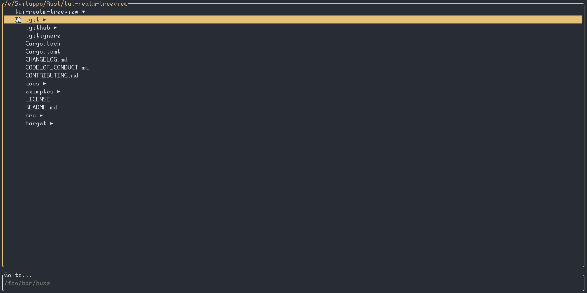

# tui-realm-textarea

<p align="center">~ Textarea component for tui-realm ~</p>
<p align="center">
  <a href="https://github.com/rhysd/tui-textarea" target="_blank">tui-textarea</a>
  ·
  <a href="https://github.com/veeso/tui-realm" target="_blank">tui-realm</a>
  ·
  <a href="https://docs.rs/tui-realm-textarea" target="_blank">Documentation</a>
</p>

<p align="center">Developed by <a href="https://veeso.github.io/" target="_blank">@veeso</a></p>
<p align="center">Current version: 1.0.0 (21/06/2022)</p>

<p align="center">
  <a href="https://opensource.org/licenses/MIT"
    ></a>
  <a href="https://github.com/veeso/tui-realm-textarea/stargazers"
    ></a>
  <a href="https://crates.io/crates/tui-realm-textarea"
    ></a>
  <a href="https://crates.io/crates/tui-realm-textarea"
    ></a>
  <a href="https://ko-fi.com/veeso">
    </a>
</p>
<p align="center">
  <a href="https://github.com/veeso/tui-realm-textarea/actions"
    ></a>
  <a href="https://docs.rs/tui-realm-textarea"
    ></a>
</p>

---

- [tui-realm-textarea](#tui-realm-textarea)
  - [About tui-realm-textarea ✏️](#about-tui-realm-textarea-️)
  - [Get started 🏁](#get-started-)
    - [Add tui-realm-textarea to your Cargo.toml 🦀](#add-tui-realm-textarea-to-your-cargotoml-)
    - [Examples 📋](#examples-)
  - [Component API](#component-api)
    - [Footer and status format](#footer-and-status-format)
  - [Documentation 📚](#documentation-)
  - [Contributing and issues 🤝🏻](#contributing-and-issues-)
  - [Changelog ⏳](#changelog-)
  - [Support the developer ☕](#support-the-developer-)
  - [License 📃](#license-)

---

## About tui-realm-textarea ✏️

tui-realm-textarea is an implementation of a **textarea component** for [tui-realm](https://github.com/veeso/tui-realm).
It is based on the [tui-textarea](https://github.com/rhysd/tui-textarea) component.



---

## Get started 🏁

### Add tui-realm-textarea to your Cargo.toml 🦀

```toml
tui-realm-textarea = "^1.0.0"
```

Or if you don't use **Crossterm**, define the backend as you do with tui-realm:

```toml
tui-realm-textarea = { version = "^1.0.0", default-features = false, features = [ "with-termion" ] }
```

### Examples 📋

View how to use the textarea component in the [example](examples/demo.rs). The example contains a simple text editor.

```sh
cargo run --example demo --features clipboard
```

Press `ESC` to quit

---

## Component API

**Commands**:

| Cmd                                            | Result         | Behaviour                               |
|------------------------------------------------|----------------|-----------------------------------------|
| `Custom($TEXTAREA_CMD_NEWLINE)`                | `None`         | Insert newline                          |
| `Custom($TEXTAREA_CMD_DEL_LINE_BY_END)`        | `None`         | Delete line by end to current position  |
| `Custom($TEXTAREA_CMD_DEL_LINE_BY_HEAD)`       | `None`         | Delete line by head to current position |
| `Custom($TEXTAREA_CMD_DEL_WORD)`               | `None`         | Delete the current word                 |
| `Custom($TEXTAREA_CMD_DEL_NEXT_WORD)`          | `None`         | Delete the next word                    |
| `Custom($TEXTAREA_CMD_MOVE_WORD_FORWARD)`      | `None`         | Move to the next word                   |
| `Custom($TEXTAREA_CMD_MOVE_WORD_BACK)`         | `None`         | Move to the previous word               |
| `Custom($TEXTAREA_CMD_MOVE_PARAGRAPH_BACK)`    | `None`         | Move to the previous paragraph          |
| `Custom($TEXTAREA_CMD_MOVE_PARAGRAPH_FORWARD)` | `None`         | Move to the next paragraph              |
| `Custom($TEXTAREA_CMD_MOVE_TOP)`               | `None`         | Move to the beginning of the file       |
| `Custom($TEXTAREA_CMD_MOVE_BOTTOM)`            | `None`         | Move to the end of the file             |
| `Custom($TEXTAREA_CMD_UNDO)`                   | `None`         | Undo last change                        |
| `Custom($TEXTAREA_CMD_REDO)`                   | `None`         | Redo last change                        |
| `Custom($TEXTAREA_CMD_PASTE)`                  | `None`         | Paste the current content of the buffer |
| `Cancel`                                       | `None`         | Delete next char                        |
| `Delete`                                       | `None`         | Delete previous char                    |
| `GoTo(Begin)`                                  | `None`         | Go to the head of the line              |
| `GoTo(End)`                                    | `None`         | Go to the end of the line               |
| `Move(Down)`                                   | `None`         | Move to the line below                  |
| `Move(Up)`                                     | `None`         | Move to the line above                  |
| `Move(Left)`                                   | `None`         | Move cursor to the left                 |
| `Move(Right)`                                  | `None`         | Move cursor to the right                |
| `Scroll(Up)`                                   | `None`         | Move by scroll_step lines up            |
| `Scroll(Down)`                                 | `None`         | Move by scroll_step lines down          |
| `Type(ch)`                                     | `None`         | Type a char in the editor               |
| `Submit`                                       | `Submit`       | Get current lines                       |

> ❗ Paste command is supported only if the `clipboard` feature is enabled

**State**: the state returned is a `Vec(String)` containing the lines in the text area.

**Properties**:

- `Borders(Borders)`: set borders properties for component
- `Custom($TREE_IDENT_SIZE, Size)`: Set space to render for each each depth level
- `Custom($TEXTAREA_MAX_HISTORY, Payload(One(Usize)))`: Set the history steps to record
- `Custom($TEXTAREA_CURSOR_STYLE, Style)`: Set the cursor style
- `Custom($TEXTAREA_CURSOR_LINE_STYLE, Style)`: Set the current line style
- `Custom($TEXTAREA_FOOTER_FMT, Payload(Tup2(Str, Style)))`: Set the format and the style for the footer bar
- `Custom($TEXTAREA_LINE_NUMBER_STYLE, Style)`: set the style for the line number
- `Custom($TEXTAREA_STATUS_FMT, Payload(Tup2(Str, Style)))`: Set the format and the style for the status bar
- `Style(Style)`: Set the general style for the textarea
- `Custom($TEXTAREA_TAB_SIZE, Size)`: Set the tab size to display
- `FocusStyle(Style)`: inactive style
- `ScrollStep(Length)`: Defines the maximum amount of rows to scroll
- `Title(Title)`: Set box title

### Footer and status format

The status and footer bars support a special syntax. The following keys can be inserted into the string:

- `{ROW}`: current row
- `{COL}`: current column

---

## Documentation 📚

The developer documentation can be found on Rust Docs at <https://docs.rs/tui-realm-textarea>

---

## Contributing and issues 🤝🏻

Contributions, bug reports, new features and questions are welcome! 😉
If you have any question or concern, or you want to suggest a new feature, or you want just want to improve tui-realm, feel free to open an issue or a PR.

Please follow [our contributing guidelines](CONTRIBUTING.md)

---

## Changelog ⏳

View tui-realm-textarea's changelog [HERE](CHANGELOG.md)

---

## Support the developer ☕

If you like tui-realm and you're grateful for the work I've done, please consider a little donation 🥳

You can make a donation with one of these platforms:

[](https://ko-fi.com/veeso)
[](https://www.paypal.me/chrisintin)

---

## License 📃

tui-realm-textarea is licensed under the MIT license.

You can read the entire license [HERE](LICENSE)
