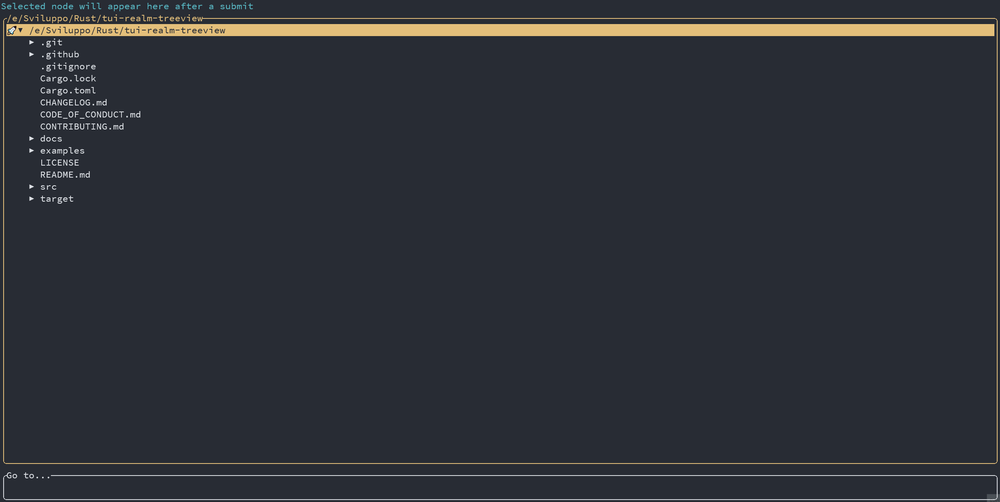

# tui-realm-treeview

<p align="center">
  
</p>

[](https://opensource.org/licenses/MIT) [](https://github.com/veeso/tui-realm-treeview) [](https://crates.io/crates/tui-realm-treeview) [](https://crates.io/crates/tui-realm-treeview) [](https://docs.rs/tui-realm-treeview)  

[](https://github.com/veeso/tui-realm-treeview/actions) [](https://github.com/veeso/tui-realm-treeview/actions) [](https://github.com/veeso/tui-realm-treeview/actions) [](https://coveralls.io/github/veeso/tui-realm-treeview?branch=main)

Developed by Christian Visintin  
Current version: 0.2.1 (02/08/2021)

---

- [tui-realm-treeview](#tui-realm-treeview)
  - [About tui-realm-treeview 🌲](#about-tui-realm-treeview-)
  - [Get started 🏁](#get-started-)
    - [Add tui-realm-treeview to your Cargo.toml 🦀](#add-tui-realm-treeview-to-your-cargotoml-)
    - [Use the treeview component](#use-the-treeview-component)
    - [About performance](#about-performance)
  - [Behaviour](#behaviour)
  - [Documentation 📚](#documentation-)
  - [Contributing and issues 🤝🏻](#contributing-and-issues-)
  - [Changelog ⏳](#changelog-)
  - [Buy me a coffee ☕](#buy-me-a-coffee-)
  - [License 📃](#license-)

---

## About tui-realm-treeview 🌲

tui-realm-treeview is an implementation of a **treeview component** for [tui-realm](https://github.com/veeso/tui-realm), it is implemented wrapping the [tui-tree-widget](https://crates.io/crates/tui-tree-widget)



---

## Get started 🏁

### Add tui-realm-treeview to your Cargo.toml 🦀

```toml
tui-realm-treeview = "0.2.1"
```

### Use the treeview component

View how to use the treeview-component following the [example](examples/demo.rs). The example contains a simple file explorer using a tree view, the depth is set to 3.

```sh
cargo run --example demo
```

- Press `ENTER` to expand the selected directory
- Press `BACKSPACE` to go to upper directory
- Move up and down with `UP/DOWN` arrow keys
- Advance by up to 8 entries with `PGUP/PGDOWN`
- Open directories with `RIGHT`
- Close directories with `LEFT`
- Change window between input field and treeview with `TAB`
- Press `ESC` to quit

### About performance

In this library there is a consistent use of recursion, and since rust is not functional, this might lead to stack overflows when dealing with huge trees. In addition consider that each level of depth added, will slow down the application exponentially.

Best practices:

- Except when dealing with small trees, always set a depth for the tree
- For file systems, depth 3 should be fine for each directory, then expand each directory on demand as implemented in the example

---

## Behaviour

**Events**:

| Event               | Message    | Behaviour                                            |
|---------------------|------------|------------------------------------------------------|
| `KeyCode::Enter`    | `OnSubmit` | Just returns submit event                            |
| `KeyCode::Down`     | `OnChange` | Go to next element                                   |
| `KeyCode::Up`       | `OnChange` | Go to previous element                               |
| `KeyCode::PageDown` | `OnChange` | Move cursor down by defined max steps or end of node |
| `KeyCode::PageUp`   | `OnChange` | Move cursor up by defined max steps or begin of node |
| `KeyCode::Right`    | `OnChange` | Open highlighted node                                |
| `KeyCode::Left`     | `OnChange` | Close highlighted node                               |
| `KeyCode::Char(_)`  | `OnKey`    | Return pressed key                                   |

**Update**: `Msg::OnChange` if the value changed, `Msg::None` otherwise.

**State**: the state returned is a `One(Str)` containing the id of the selected node. If no node is selected `None` is returned.

**Properties**:

- `with_foreground`: foreground color. The foreground will be used as foreground for the selected item, when focus is false, otherwise as background
- `with_background`: background color. The background color will be used as background for unselected entry, but will be used as foreground for the selected entry when focus is true
- `with_borders`: set borders properties for component
- `with_title`: Set box title
- `with_highlighted_str`: The provided string will be displayed on the left side of the selected entry in the tree
- `with_tree_and_depth`: Sets the tree and its max depth for Props builder
- `with_tree`: Sets the tree for Props builder
- `with_node`: Select initial node in the tree. This option has priority over `keep_state`
- `keep_state`: If keep is true, the selected entry will be kept after an update of the tree (obviously if the entry still exists in the tree).
- `with_max_page_steps`: Defines the maximum amount of steps to perform after a PG_DOWN / PG_UP

---

## Documentation 📚

The developer documentation can be found on Rust Docs at <https://docs.rs/tui-realm-treeview>

---

## Contributing and issues 🤝🏻

Contributions, bug reports, new features and questions are welcome! 😉
If you have any question or concern, or you want to suggest a new feature, or you want just want to improve tui-realm, feel free to open an issue or a PR.

Please follow [our contributing guidelines](CONTRIBUTING.md)

---

## Changelog ⏳

View tui-realm-treeview's changelog [HERE](CHANGELOG.md)

---

## Buy me a coffee ☕

If you like tui-realm-treeview and you're grateful for the work I've done, please consider a little donation 🥳

[](https://www.buymeacoffee.com/veeso)

---

## License 📃

tui-realm is licensed under the MIT license.

You can read the entire license [HERE](LICENSE)
