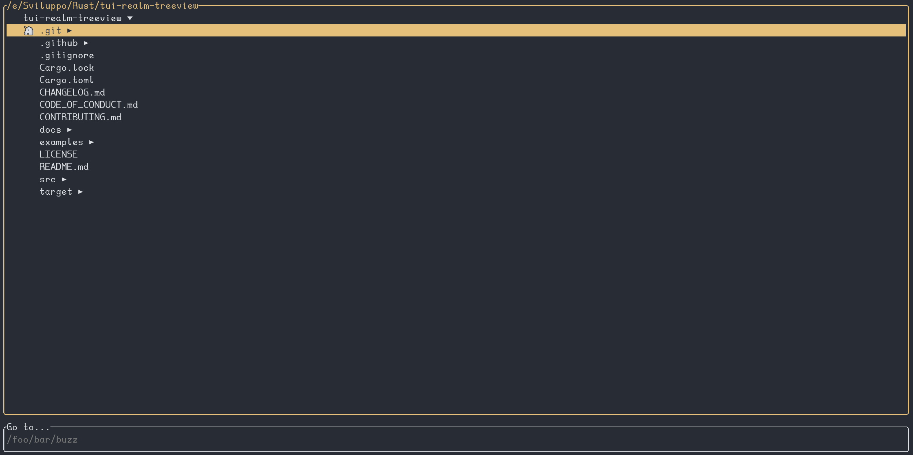

# tui-realm-treeview

<p align="center">
  
</p>

<p align="center">~ Treeview component for tui-realm ~</p>
<p align="center">
  <a href="https://github.com/veeso/orange-trees" target="_blank">orange trees</a>
  ·
  <a href="https://github.com/veeso/tui-realm" target="_blank">tui-realm</a>
  ·
  <a href="https://docs.rs/tui-realm-treeview" target="_blank">Documentation</a>
</p>

<p align="center">Developed by <a href="https://veeso.github.io/" target="_blank">@veeso</a></p>
<p align="center">Current version: 2.0.0 (13/10/2024)</p>

<p align="center">
  <a href="https://opensource.org/licenses/MIT"
    ></a>
  <a href="https://github.com/veeso/tui-realm-treeview/stargazers"
    ></a>
  <a href="https://crates.io/crates/tui-realm-treeview"
    ></a>
  <a href="https://crates.io/crates/tui-realm-treeview"
    ></a>
  <a href="https://ko-fi.com/veeso">
    </a>
</p>
<p align="center">
  <a href="https://github.com/veeso/tui-realm-treeview/actions"
    ></a>
  <a href="https://coveralls.io/github/veeso/tui-realm-treeview"
    ></a>
  <a href="https://docs.rs/tui-realm-treeview"
    ></a>
</p>

---

- [tui-realm-treeview](#tui-realm-treeview)
  - [About tui-realm-treeview 🌲](#about-tui-realm-treeview-)
  - [Get started 🏁](#get-started-)
    - [Add tui-realm-treeview to your Cargo.toml 🦀](#add-tui-realm-treeview-to-your-cargotoml-)
    - [Examples 📋](#examples-)
    - [About performance](#about-performance)
  - [Component API](#component-api)
    - [Updating the tree](#updating-the-tree)
      - [Remounting the component](#remounting-the-component)
      - [Updating the tree from the "on" method](#updating-the-tree-from-the-on-method)
  - [Documentation 📚](#documentation-)
  - [Contributing and issues 🤝🏻](#contributing-and-issues-)
  - [Changelog ⏳](#changelog-)
  - [Support the developer ☕](#support-the-developer-)
  - [License 📃](#license-)

---

## About tui-realm-treeview 🌲

tui-realm-treeview is an implementation of a **treeview component** for [tui-realm](https://github.com/veeso/tui-realm).
It uses the [Orange trees](https://github.com/veeso/orange-trees) engine for implementing trees.



---

## Get started 🏁

### Add tui-realm-treeview to your Cargo.toml 🦀

```toml
tui-realm-treeview = "2"
```

Or if you don't use **Crossterm**, define the backend as you do with tui-realm:

```toml
tui-realm-treeview = { version = "2", default-features = false, features = [ "termion" ] }
```

### Examples 📋

View how to use the treeview-component following the [example](examples/demo.rs). The example contains a simple file explorer using a tree view, the depth is set to 3.

```sh
cargo run --example demo
```

- Press `ENTER` to expand the selected directory
- Press `BACKSPACE` to go to upper directory
- Move up and down with `UP/DOWN` arrow keys
- Advance by up to 6 entries with `PGUP/PGDOWN`
- Open directories with `RIGHT`
- Close directories with `LEFT`
- Change window between input field and treeview with `TAB`
- Press `ESC` to quit

### About performance

❗ If you were a tui-realm-treeview 0.x user, I'm glad to announce that this new version of the library is much more
faster and reliable than the older version. That's because now I'm using a new engine for trees and I'm no more
relying on the tui_tree_widget, which required me to convert the tree into another kind of structure which wasn't
really compatible with the tree data structure. For this new library I've re-implemented everything, including the widget, to be 100% compatible with the orange-trees engine.

In this library there is a consistent use of recursion, and since rust is not functional, this might lead to stack overflows when dealing with huge trees.

---

## Component API

**Commands**:

| Cmd                       | Result            | Behaviour                                            |
|---------------------------|-------------------|------------------------------------------------------|
| `Custom($TREE_CMD_CLOSE)` | `None`            | Close selected node                                  |
| `Custom($TREE_CMD_OPEN)`  | `None`            | Open selected node                                   |
| `GoTo(Begin)`             | `Changed \| None` | Move cursor to the top of the current tree node      |
| `GoTo(End)`               | `Changed \| None` | Move cursor to the bottom of the current tree node   |
| `Move(Down)`              | `Changed \| None` | Go to next element                                   |
| `Move(Up)`                | `Changed \| None` | Go to previous element                               |
| `Scroll(Down)`            | `Changed \| None` | Move cursor down by defined max steps or end of node |
| `Scroll(Up)`              | `Changed \| None` | Move cursor up by defined max steps or begin of node |
| `Submit`                  | `Submit`          | Just returns submit result with current state        |

**State**: the state returned is a `One(String)` containing the id of the selected node. If no node is selected `None` is returned.

**Properties**:

- `Background(Color)`: background color. The background color will be used as background for unselected entry, but will be used as foreground for the selected entry when focus is true
- `Borders(Borders)`: set borders properties for component
- `Custom($TREE_IDENT_SIZE, Size)`: Set space to render for each each depth level
- `Custom($TREE_INITIAL_NODE, String)`: Select initial node in the tree. This option has priority over `keep_state`
- `Custom($TREE_PRESERVE_STATE, Flag)`: If true, the selected entry will be kept after an update of the tree (obviously if the entry still exists in the tree).
- `FocusStyle(Style)`: inactive style
- `Foreground(Color)`: foreground color. The foreground will be used as foreground for the selected item, when focus is false, otherwise as background
- `HighlightedColor(Color)`: The provided color will be used to highlight the selected node. `Foreground` will be used if unset.
- `HighlightedStr(String)`: The provided string will be displayed on the left side of the selected entry in the tree
- `ScrollStep(Length)`: Defines the maximum amount of rows to scroll
- `TextProps(TextModifiers)`: set text modifiers
- `Title(Title)`: Set box title

### Updating the tree

The tree in this component is not inside the `props`, but is a member of the `TreeView` mock component structure.
In order to update and work with the tree you've got basically two ways to do this.

#### Remounting the component

In situation where you need to update the tree on the update routine (as happens in the example), the best way to update the tree is to remount the component from scratch.
If you follow the example, you'll see I've implemented the constructor for my treeview component as follows:

```rust
impl FsTree {
    pub fn new(tree: Tree, initial_node: Option<String>) -> Self {
        // Preserve initial node if exists
        let initial_node = match initial_node {
            Some(id) if tree.root().query(&id).is_some() => id,
            _ => tree.root().id().to_string(),
        };
        FsTree {
            component: TreeView::default()
                .foreground(Color::Reset)
                .borders(
                    Borders::default()
                        .color(Color::LightYellow)
                        .modifiers(BorderType::Rounded),
                )
                .inactive(Style::default().fg(Color::Gray))
                .indent_size(3)
                .scroll_step(6)
                .title(tree.root().id(), Alignment::Left)
                .highlighted_color(Color::LightYellow)
                .highlight_symbol("🦄")
                .with_tree(tree)
                .initial_node(initial_node),
        }
    }
}
```

I always set the initial_node and the tree in the constructor. This implementation allows me to update the tree whenever I want without losing the current state.

#### Updating the tree from the "on" method

This method is probably better than remounting, but it is not always possible to use this.
When you implement `Component` for your treeview, you have a mutable reference to the component, and so here you can call these methods to operate on the tree:

- `pub fn tree(&self) -> &Tree`: returns a reference to the tree
- `pub fn tree_mut(&mut self) -> &mut Tree`: returns a mutable reference to the tree; which allows you to operate on it
- `pub fn set_tree(&mut self, tree: Tree)`: update the current tree with another
- `pub fn tree_state(&self) -> &TreeState`: get a reference to the current tree state. (See tree state docs)

You can access these methods from the `on()` method as said before. So these methods can be handy when you update the tree after a certain events or maybe even better, you can set the tree if you receive it from a `UserEvent` produced by a **Port**.

---

## Documentation 📚

The developer documentation can be found on Rust Docs at <https://docs.rs/tui-realm-treeview>

---

## Contributing and issues 🤝🏻

Contributions, bug reports, new features and questions are welcome! 😉
If you have any question or concern, or you want to suggest a new feature, or you want just want to improve tui-realm, feel free to open an issue or a PR.

Please follow [our contributing guidelines](CONTRIBUTING.md)

---

## Changelog ⏳

View tui-realm-treeview's changelog [HERE](CHANGELOG.md)

---

## Support the developer ☕

If you like tui-realm and you're grateful for the work I've done, please consider a little donation 🥳

You can make a donation with one of these platforms:

[](https://ko-fi.com/veeso)
[](https://www.paypal.me/chrisintin)

---

## License 📃

tui-realm-treeview is licensed under the MIT license.

You can read the entire license [HERE](LICENSE)
