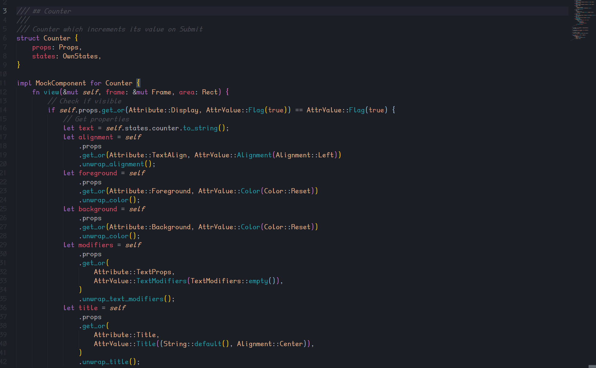

# tui-realm

<p align="center">
  
</p>

<p align="center">~ A ratatui framework inspired by Elm and React ~</p>
<p align="center">
  <a href="docs/en/get-started.md" target="_blank">Get started</a>
  ·
  <a href="https://github.com/veeso/tui-realm/tree/main/crates/tuirealm-stdlib" target="_blank">Standard Library</a>
  ·
  <a href="https://docs.rs/tuirealm" target="_blank">Documentation</a>
</p>

<p align="center">Developed by <a href="https://veeso.github.io/" target="_blank">@veeso</a></p>
<p align="center">Current version: 4.0.0 (2026-04-18)</p>

<p align="center">
  <a href="https://opensource.org/licenses/MIT"
    ></a>
  <a href="https://github.com/veeso/tui-realm/stargazers"
    ></a>
  <a href="https://crates.io/crates/tuirealm"
    ></a>
  <a href="https://crates.io/crates/tuirealm"
    ></a>
  <a href="https://ko-fi.com/veeso">
    </a>
</p>
<p align="center">
<a href="https://github.com/veeso/tui-realm/actions/workflows/tests.yml"
    ></a>
  <a href="https://coveralls.io/github/veeso/tui-realm"
    ></a>
  <a href="https://docs.rs/tuirealm"
    ></a>
</p>

---

- [tui-realm](#tui-realm)
  - [About tui-realm 👑](#about-tui-realm-)
  - [Features 🎁](#features-)
  - [Get started 🏁](#get-started-)
    - [Add tui-realm to your Cargo.toml 🦀](#add-tui-realm-to-your-cargotoml-)
      - [Enabling other backends ⚠️](#enabling-other-backends-️)
    - [Create a tui-realm application 🪂](#create-a-tui-realm-application-)
    - [Run examples 🔍](#run-examples-)
  - [Standard components library 🎨](#standard-components-library-)
  - [Community components 🏘️](#community-components-️)
  - [Guides 🎓](#guides-)
  - [Documentation 📚](#documentation-)
  - [Apps using tui-realm 🚀](#apps-using-tui-realm-)
  - [Support the developer ☕](#support-the-developer-)
  - [Contributing and issues 🤝🏻](#contributing-and-issues-)
  - [Changelog ⏳](#changelog-)
  - [License 📃](#license-)

---

## About tui-realm 👑

`tui-realm` is a **framework** for **[ratatui](https://github.com/ratatui-org/ratatui)** to simplify the implementation of terminal user interfaces adding the possibility to work with re-usable components with properties and states, as you'd do in React. But that's not all: the components communicate with the ui engine via a system based on **Messages** and **Events**, providing you with the possibility to implement `update` routines as happens in Elm. In addition, the components are organized inside the **View**, which manages mounting/umounting, focus and event forwarding for you.

And that also explains the reason of the name: **Realm stands for React and Elm**.

tui-realm also comes with a standard library of components, which can be added to your dependencies, that you may find very useful. Don't worry, they are optional if you don't want to use them 😉, just follow the guide in [get started](#get-started-) section.



See tui-realm in action in the [Example](#run-examples-) or if you want to read more about tui-realm start reading the official [Get Started Guide](docs/en/get-started.md).

## Features 🎁

- ⌨️ **Event-driven**
- ⚛️ Based on **React** and **Elm**
- 🍲 **Boilerplate** code
- 🚀 Quick-setup
- 🎯 Single **focus** and **states** management
- 🙂 Easy to learn
- 🤖 Adaptable to any use case

---

## Get started 🏁

> ⚠️ Warning: currently tui-realm supports these backends: crossterm, termion, termwiz

### Add tui-realm to your Cargo.toml 🦀

If you want the default features, just add tuirealm with version:

```toml
tuirealm = "4"
```

otherwise you can specify the features you want to add:

```toml
tuirealm = { version = "4", default-features = false, features = [ "derive", "serialize", "termion" ] }
```

Supported features are:

- `derive` (*default*): add the `#[derive(Component)]` proc macro to automatically implement `Component` for `Component`. [Read more](../tuirealm-derive/).
- `serialize`: add the serialize/deserialize trait implementation for `KeyEvent` and `Key`.
- `crossterm`: use the [crossterm](https://github.com/crossterm-rs/crossterm) terminal & input backend
- `termion`: use the [termion](https://github.com/redox-os/termion) terminal & input backend
- `termwiz`: use the [termwiz](https://docs.rs/termwiz/latest/termwiz/index.html) terminal & input backend
- `async-ports`: enable async (tokio) ports

#### Enabling other backends ⚠️

This library supports all backends supported by `ratatui`, which are `crossterm`(default),
`termion` and `termwiz`. When deciding to use any other backend other than `crossterm`,
`default-features` should be disabled to save on extra dependencies of unused backends.

> ❗ The two features can co-exist, even if it doesn't make too much sense.
> ❗ Backends other than `crossterm` may not have the best support.

Example using crossterm backend explicitly:

```toml
tuirealm = { version = "4", default-features = false, features = [ "derive", "crossterm" ]}
```

Example using the termion backend:

```toml
tuirealm = { version = "4", default-features = false, features = [ "derive", "termion" ] }
```

Example using the termwiz backend:

```toml
tuirealm = { version = "4", default-features = false, features = [ "derive", "termwiz" ] }
```

### Create a tui-realm application 🪂

View how to implement a tui-realm application in the [Get Started Guide](docs/en/get-started.md).

### Run examples 🔍

Interested in how tui-realm works and how the resulting code looks? Try the examples:

- [demo](examples/demo/demo.rs): a simple example that shows basic tui-realm usage
- [user-events](examples/user_events/user_events.rs): showcase using custom events
- [inline-display](examples/inline_display.rs): showcase how tui-realm can be used without requiring a alternate screen
- [async-ports](examples/async_ports.rs): showcase usage of async ports
- [arbitrary-data](examples/arbitrary_data.rs): showcase usage of `PropPayload::Any` to send custom data across `query` and `attr`

---

## Standard components library 🎨

`tui-realm` has a optional standard library called [`tui-realm-stdlib`](../tuirealm-stdlib/),
which wraps common widgets from `ratatui` for usage in tui-realm.
If you want to use it, just add the [`tui-realm-stdlib`](../tuirealm-stdlib/) to your `Cargo.toml` dependencies.

## Community components 🏘️

These components may not included in tui-realm or the stdlib, but have been developed by other users. I like advertising other's contents, so here you can find a list of components you may find useful for your next tui-realm project 💜.

- [`tui-realm-textarea`](../tuirealm-textarea/) A textarea/editor component developed by [@veeso](https://github.com/veeso)
- [`tui-realm-treeview`](../tuirealm-treeview/) A treeview component developed by [@veeso](https://github.com/veeso)
- [`tuirealm-orx-tree`](https://github.com/hasezoey/tuirealm-orx-tree) Another treeview component developed by [@hasezoey](https://github.com/hasezoey)

Want to add yours? Open an issue using the `New app/component` template 😄

---

## Guides 🎓

- [Get Started Guide](docs/en/get-started.md)
- [Advanced concepts](docs/en/advanced.md)

---

## Documentation 📚

The developer documentation can be found on Rust Docs at <https://docs.rs/tuirealm>

---

## Apps using tui-realm 🚀

- [BugStalker](https://github.com/godzie44/BugStalker)
- [cliflux](https://github.com/spencerwi/cliflux)
- [csvs](https://github.com/koma-private/csvs)
- [donmaze](https://github.com/veeso/donmaze)
- [matrix-rust-sdk](https://github.com/matrix-org/matrix-rust-sdk)
- [opencode-kanban](https://github.com/qrafty-ai/opencode-kanban)
- [paat](https://github.com/ebakoba/paat)
- [termusic](https://github.com/tramhao/termusic)
- [termscp](https://github.com/veeso/termscp)
- [tisq](https://crates.io/crates/tisq)
- [todotui](https://github.com/newfla/todotui)
- [tuifeed](https://github.com/veeso/tuifeed)
- [turdle](https://crates.io/crates/turdle)
- [quetty](https://crates.io/crates/quetty)

Want to add yours? Open an issue using the `New app/component` template 😄

---

## Support the developer ☕

If you like tui-realm and you're grateful for the work I've done, please consider a little donation 🥳

You can make a donation with one of these platforms:

[](https://ko-fi.com/veeso)
[](https://www.paypal.me/chrisintin)

---

## Contributing and issues 🤝🏻

Contributions, bug reports, new features and questions are welcome! 😉
If you have any question or concern, or you want to suggest a new feature, or you want just want to improve tui-realm, feel free to open an issue or a PR.

Please follow [our contributing guidelines](CONTRIBUTING.md)

---

## Changelog ⏳

View tui-realm's changelog [HERE](../../CHANGELOG.md)

---

## License 📃

tui-realm is licensed under the MIT license.

You can read the entire license [HERE](LICENSE)
