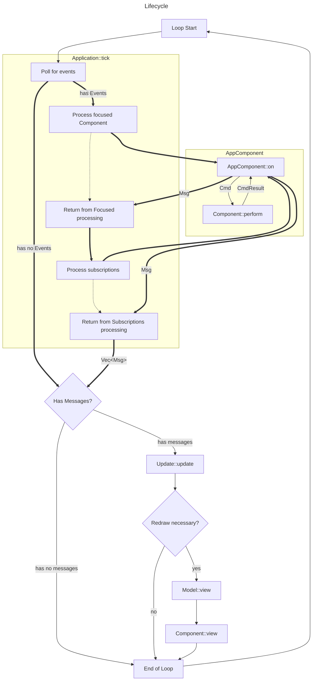

# 快速入门 🏁

<a href="../en/get-started.md">English</a> | 📍<u>**简体中文**</u>

- [快速入门 🏁](#快速入门-)
  - [Realm 简介](#realm-简介)
  - [核心概念](#核心概念)
  - [Component 与 AppComponent](#component-与-appcomponent)
    - [Component](#component)
    - [AppComponent](#appcomponent)
    - [属性 (Properties) 与状态 (States)](#属性-properties-与状态-states)
    - [事件 (Events) 与命令 (Commands)](#事件-events-与命令-commands)
  - [Application、Model 和 View](#applicationmodel-和-view)
    - [View](#view)
      - [焦点 (Focus)](#焦点-focus)
    - [Model](#model)
    - [Application](#application)
  - [生命周期 (或 "tick")](#生命周期-或-tick)
  - [我们的第一个应用](#我们的第一个应用)
    - [实现 Counter](#实现-counter)
    - [定义消息类型](#定义消息类型)
    - [定义组件标识符](#定义组件标识符)
    - [实现两个计数器组件](#实现两个计数器组件)
    - [实现 Model](#实现-model)
    - [应用设置与主循环](#应用设置与主循环)
  - [下一步](#下一步)

---

## Realm 简介

你将学习到：

- tui-realm 的核心概念
- 如何从零开始编写一个 tui-realm 应用
- tui-realm 的亮点特性

`tui-realm` 是一个 ratatui **框架**，提供了实现有状态 (stateful) 应用的简便方法。
首先，让我们看看 tui-realm 的主要特性以及为什么在构建终端用户界面时应该选择此框架：

- ⌨️ **事件驱动**

    `tui-realm` 采用源自 Elm 的 `Event -> Msg` 模式。**事件 (Events)** 由称为 `Port` 的实体产生，它们作为事件监听器工作 (例如 stdin 读取器或 HTTP 客户端)，产生事件。这些事件随后被转发到 **Components**，组件会产生一个 **Message**。消息随后会根据其变体在应用 model 中引起特定行为。

- ⚛️ 基于 **React** 和 **Elm**

    `tui-realm` 采纳了 [React](https://reactjs.org/) 和 [Elm](https://elm-lang.org/) 的部分元素。这两者的方法不同，但我决定从中各取精华，将它们结合到 **Realm** 中。从 React 中我采用了 **Component** 概念。在 realm 中，每个组件代表一个图形实例，可能包含一些子组件；每个组件都有一个 **State** 和一些 **Properties**。
    从 Elm 中我基本采用了 Realm 中实现的其余所有概念。我真的很喜欢 Elm 作为一门语言，特别是 **TEA** (`The Elm Architecture`)。
    与 Elm 一样，realm 中应用的生命周期是 `-> Event -> Msg -> Update -> View ->`。

- 🍲 **样板代码**

    `tui-realm` 开始使用时可能看起来很难，但使用一段时间后你会开始意识到，你正在实现的代码只是从先前组件复制过来的样板代码。

- 🚀 快速设置

    得益于 `Application`、`EventListener`、终端后端以及 stdlib，上手非常容易。

- 🎯 单一的 **焦点** 和 **状态** 管理

    在 realm 中，你不必自己管理焦点和状态，一切都由 **View** 自动管理，所有组件都挂载在 View 中。使用 realm，你再也不必担心应用状态和焦点了。

- 🙂 易于学习

    得益于指南、示例和简单直接的类型，即使你以前从未使用过 tui、React 或 Elm，学习 tui-realm 也非常容易。

- 🤖 适应任何用例

    正如你将在本指南中学到的，`tui-realm` 公开了一些高级概念，用于创建你自己的事件监听器、处理自己的事件以及实现复杂的组件。

---

## 核心概念

在简介中你可能已经读到了一些 **加粗** 的概念，但现在让我们详细了解它们。核心概念非常重要，幸运的是它们易于理解，而且数量不多：

- **Component**：Component 代表一个可复用的 UI 组件，可以拥有一些用于渲染或处理命令的 **属性**。如果需要，它还可以拥有自己的 **状态**。实际上，它是一个 trait，公开了一些用于渲染和处理属性、状态和事件的方法。我们将在下一章中详细讨论。
- **AppComponent**：AppComponent 是 **Component** 的包装器，代表你应用中的单个组件。它直接接收事件并为应用消费者生成消息。在底层，它依赖其 Component 进行属性/状态管理和渲染。
- **State**：状态代表组件的当前状态 (例如，文本输入框中的当前文本)。状态取决于用户 (或其他来源) 如何与组件交互 (例如，用户按下 'a'，字符被推送到文本输入框)。
- **Attribute**：属性描述组件中的单个属性 (property)。属性不应依赖于组件状态，而应仅在组件初始化时由用户配置。通常，一个组件会公开许多可配置的属性，而使用该 Component 的 AppComponent 会根据用户的需要设置它们。
- **Event**：事件是一个 **原始** 实体，描述发生了某些事情，例如用户输入或其他来源 (我们将在 "高级概念" 中讨论后者)。
- **Message** (通常称为 `Msg`)：消息是由 AppComponents 在响应 `Event` 时生成的逻辑事件，由 `Model` 消费。
    事件是 *原始* 的 (例如按键操作)，而消息是面向应用的。消息随后由 **更新例程 (Update routine)** 消费。

- **Command** (通常称为 `Cmd`)：是由 **AppComponent** 在接收到 **Event** 时生成的实体。AppComponent 使用它来操作其 **Component**。
- **View**：View 是所有组件存储的地方。View 基本上有三个任务：
  - **管理 AppComponent 的挂载/卸载**：AppComponent 在创建时挂载到 View 中。View 会防止挂载重复的 AppComponent (基于相同的 `Id`)，并在你尝试操作未挂载的 AppComponent 时发出警告。
  - **管理焦点**：View 保证一次只有一个 AppComponent 处于活动状态。活动的 AppComponent 启用了一个专用属性 (我们将在后面看到)，所有事件都会转发给它 (以及所有 *已订阅* 的 AppComponent)。View 跟踪所有先前持有焦点的 AppComponent，因此如果当前活动的 AppComponent 失去焦点，则前一个活动的 AppComponent 会在没有其他可激活的 AppComponent 时重新变为活动状态。
  - **提供操作 AppComponent 的 API**：一旦 AppComponent 挂载到 View 中，它们必须以安全的方式对外部可访问。这得益于 View 公开的桥接方法。由于每个 AppComponent 必须被唯一标识才能访问，你需要为 AppComponent 定义一些 **ID**。
- **Model**：Model 是你为应用定义的结构，用于实现 **更新例程**。
- **更新例程 (Update routine)**：更新例程是必须由 **Model** 实现的函数。这个函数既简单又重要。它只接受 2 个参数：自身的可变引用和要处理的 **Message**。基于 *Message*，它会在 Model 或 View 上触发特定行为。该例程也可以返回一个 *Message*，这将导致 application 使用给定的 *Message* 再次调用此例程。稍后，当我们看到示例时，你会发现这有多酷。
- **Subscription** (通常称为 *Sub*)：订阅是一个规则集，它告诉 **application** 也将特定事件转发给其他 AppComponent，即使它们不处于焦点。我们将在高级概念中讨论订阅。
- **Port**：Port 是一个事件监听器，它将使用名为 `Poll` 的 trait 来获取传入事件。Port 定义了要调用的 trait 和每次调用之间必须经过的时间间隔。事件随后会被转发给订阅的 AppComponent。输入监听器就是一个 port，但你也可以实现例如 HTTP 客户端来获取数据。Port 会在高级概念中详细介绍。
- **Event Listener**：这是一个线程，它轮询 **Ports** 以读取传入事件。**Events** 随后报告给 **Application**。
- **Application**：Application 是 **View**、**Subscriptions** 和 **Event Listener** 的超级包装器。它公开了到 View 的桥接、一些 *subscriptions* 的简写；但它的主要函数是 `tick()`。正如我们稍后会看到的，`tick` 是所有框架魔法发生的地方。

---

## Component 与 AppComponent

即使读过上面的描述，你可能还是会问自己 "这两者有什么区别，为什么两者都是必需的？"。
这主要是由于 Event 的设计方式允许自定义 `UserEvent`s，以及 Rust 的工作方式。如果这两个 trait 合二为一，那么像 stdlib 这样的库仍然需要实现一个部分的 `on` 更新函数，只能依赖 `tui-realm` 核心提供的 Event 变体。它们还可能需要在每个 Component 上加一个实际上没用的泛型，因为无法依赖 `UserEvent`s，会增加额外的冗余。
分开的 trait 也带来了良好的关注点分离，并允许修改事物传递给底层 Component 的方式。

另外请记住，**AppComponent** 始终是一个 **Component**，但一个 **Component** 只 *可能* 是一个 **AppComponent**。

让我们详细了解它们的定义：

### Component

Component 旨在对事件保持 *agnostic* (不可知)，并可在其他地方 *复用* (甚至在不同的项目中)。

例如：

- ✅ 显示单行文本的 Label 是一个好的 Component。
- ✅ 像 HTML 中的 `<input>` 这样的 Input 组件是一个好的 Component。即使它可以处理许多输入类型，它仍然只有一个职责，是通用的且可复用的。
- ❌ 同时处理文本、单选按钮和复选框的 input 是一个糟糕的 Component。它太过宽泛。
- ❌ 接收服务器远程地址的 input 是一个糟糕的 Component。它不够通用。

这些只是一些指南，但只是为了让你了解什么是 Component。

Component 还会处理 **States** 和 **Props**，它们完全由用户根据你的需求定义。有时你甚至可能有一个不处理任何状态的 Component (例如 Label)。

实际上，Component 是一个 trait，需要实现以下方法：

```rust
pub trait Component {
    fn view(&mut self, frame: &mut Frame, area: Rect);
    fn query<'a>(&'a self, attr: Attribute) -> Option<QueryResult<'a>>;
    fn attr(&mut self, attr: Attribute, value: AttrValue);
    fn state(&self) -> State;
    fn perform(&mut self, cmd: Cmd) -> CmdResult;
}
```

trait 要求你实现：

- *view*：在提供的区域中渲染组件的方法。你必须使用 `ratatui` widgets 根据组件的属性和状态来渲染组件。
- *query*：返回组件属性中某个 attribute 的值。
- *attr*：给组件属性赋一个某 attribute 的值。
- *state*：获取当前组件的状态。如果没有状态，则返回 `State::None`。
- *perform*：对组件执行提供的 **command**。此方法由 **AppComponent** 调用 (我们稍后会看到)。该命令应该改变组件状态。处理完动作后，必须将 `CmdResult` 返回给 **AppComponent**。

### AppComponent

所以，显然 Component 已经定义了我们处理属性、状态和渲染所需的一切。那么为什么我们还需要一个 AppComponent trait？

1. AppComponent 必须对 **Event** 保持 agnostic：Component 可能会在库中分发 (例如 `tui-realm-stdlib`)，因此它们不能消费 `Event` 或产生 `Message`。
2. 由于第 1 点，我们需要一个能消费 **Event** 并产生 **Messages** 的实体。这两个实体完全或部分由用户定义，意味着它们对每个 realm 应用都不同。这意味着 AppComponent 必须适配具体的应用。
3. **不可能让一个 Component 满足所有人的需求**：我在 `tui-realm` 0.x 中尝试过，但这根本不可能。在某一时刻我开始在已有属性上加更多属性，但最终不得不从头重新实现 stdlib 组件，只是为了得到一些不同的逻辑。Component 很好，因为它们是通用的，但不要太通用；它们对我们来说必须像笨小孩一样。Component 正是我们想要的应用基础。举例来说，我们有一个 Input，并希望它根据输入的内容改变颜色；一个应用可能想在输入 `a` 时改变颜色，另一个应用可能想在输入 `the` 时改变颜色。这对给定的 Input 可以通过大量选项或校验来实现，但这种逻辑更适合放在 **AppComponent** 而不是 **Component** 中。哦，我差点忘了将 Component 一般化最糟糕的部分：**键绑定**。

说到这里，AppComponent 到底是什么？

AppComponent 是一个 Component 的应用特定唯一实现。以表单为例，假设第一个字段是一个接收用户名的文本输入。如果用 HTML 来想，它肯定是一个 `<input type="text" />` 对吧？仅凭这个定义，该 input 对输入的具体文本是通用的，它可能有一些校验，但最终在提交时没有意义。但我们希望它是我们的 username 输入，并在提交时生成合适的 **Message**。因此该文本输入将是 tui-realm 中的 `Component`。但 *那个* "username" 输入字段将是 *你* 的 **用户名文本输入**。`UsernameInput` *AppComponent* 将包装一个 `Input` *Component*，但基于传入事件，它会以不同方式操作该 Component，并且与例如 `EmailInput` 相比会产生不同的 **Messages**。

所以，从现在起必须牢记最重要的一点：**AppComponent 在你的应用中是唯一的 ❗**。你 **绝不应该盲目地多次使用同一个 AppComponent**。

现在让我们看看 AppComponent 在实际中是什么样的：

```rust
pub trait AppComponent<Msg, UserEvent>: Component
where
    Msg: PartialEq,
    UserEvent: Eq + PartialEq + Clone,
{
    fn on(&mut self, ev: &Event<UserEvent>) -> Option<Msg>;
}
```

很简单吧？是的，我有意让它们尽可能轻量，因为你必须为 view 中的每个组件实现一个。正如你可能注意到的，**AppComponent** 还要求实现 **Component**，所以实际上我们也会看到类似这样的东西：

```rust
pub struct UsernameInput {
    component: Input, // Input 实现了 `Component`
}

impl Component for UsernameInput { /* 透传到 "self.component" */ }
impl AppComponent for UsernameInput { ... }
```

由于每个 **AppComponent** 都需要实现 **Component**，并且透传调用非常常见，可以使用 `#[derive(Component)]` 来代替。

你可能注意到的另一件事、也可能会让一些人感到担心的是 AppComponent 的两个泛型类型。
让我们看看这两个类型是什么：

- `Msg` (也称为 **Message**)：定义你的应用将在 **更新例程** 中处理的 **Message** 类型。实际上，在 `tui-realm` 中，消息不是在库中定义的，而是由用户定义的。我们将在后面的 [我们的第一个应用](#我们的第一个应用) 中详细讨论。Message 的唯一要求是它必须实现 `PartialEq`，因为你必须能在 **更新例程** 中匹配它。
- `UserEvent`：用户事件定义了你的应用可以处理的自定义事件。正如我们之前所说，`tui-realm` 通常会发送关于用户输入或终端事件的事件，加上一个称为 `Tick` 的特殊事件 (我们稍后会讨论它)。除了这些常见事件，自定义 **Port** 可能返回来自其他来源的事件，这些事件不符合常见事件的类型。由于 `tui-realm` 需要知道这些事件是什么，你需要提供你的 ports 将产生的类型 (更多内容请参见 [高级指南](./advanced.md))。

    如果我们看一下 `Event` 枚举，一切就都清晰了：

    ```rust
    pub enum Event<UserEvent>
    where
        UserEvent: Eq + PartialEq + Clone,
    {
        /// 键盘事件
        Keyboard(KeyEvent),
        /// 终端窗口调整大小后引发的事件
        WindowResize(u16, u16),
        /// UI tick 事件 (应可配置)
        Tick,
        /// 未处理的事件；空事件
        None,
        /// 用户事件；不会被标准库或默认输入事件监听器使用；
        /// 但可以在用户定义的 ports 中使用
        User(UserEvent),
    }
    ```

    如你所见，`Event` 有一个称为 `User` 的特殊变体，它接受一个特殊类型 `UserEvent`，确实可以用于使用用户定义的事件。

    > ❗ 如果你的应用中没有任何 `UserEvent`，可以声明事件时使用 `Event<NoUserEvent>`，这是 `tui-realm` 提供的。

从现在开始使用 "**Component**" 可能也意味着实现了 **AppComponent**，除非另有说明。

### 属性 (Properties) 与状态 (States)

所有组件都由属性描述，并且通常也由状态描述。但它们之间有什么区别？

基本上 **Properties** 描述组件如何渲染以及它应该如何行为。

例如，属性是 **样式**、**颜色** 或一些属性比如 "这个列表应该滚动吗？"。
属性始终存在于组件中。

另一方面，States 是可选的，*通常* 仅由用户可以与之交互的组件使用。
状态不会描述样式或组件的行为方式，而是组件的当前状态。状态通常也会在用户执行某个 **Command** 之后发生变化。

让我们看看如何在一个组件上区分属性和状态，假设这个组件是一个 *Checkbox*：

- checkbox 的前景色和背景色是 **Properties** (交互时不变)
- checkbox 选项是 **Properties**
- 当前选中的选项是 **States** (它们在用户交互时改变)
- 当前高亮的项目是 **State**

### 事件 (Events) 与命令 (Commands)

我们几乎已经看到了关于组件的所有方面，但仍然需要讨论一个重要概念，即 **Events** 和 **Commands** 之间的区别。

如果我们看一下 **AppComponent** trait，可以看到 `on()` 方法的签名如下：

```rust
fn on(&mut self, ev: &Event<UserEvent>) -> Option<Msg>;
```

我们知道 `AppComponent::on()` 会调用其 **Component** 的 `perform()` 方法，以更新其状态。perform 方法的签名如下：

```rust
fn perform(&mut self, cmd: Cmd) -> CmdResult;
```

如你所见，**AppComponent** 消费一个 `Event` 并产生一个 `Msg`，而底层 Component 则消费一个 `Cmd` 并产生一个 `CmdResult`。

如果我们看一下两个类型声明，就会发现它们在作用域上存在差异：

```rust
pub enum Event<UserEvent>
where
    UserEvent: Eq + PartialEq + Clone,
{
    /// 键盘事件
    Keyboard(KeyEvent),
    /// 终端窗口调整大小后引发的事件
    WindowResize(u16, u16),
    /// UI tick 事件 (应可配置)
    Tick,
    /// 未处理的事件；空事件
    None,
    /// 用户事件；不会被标准库或默认输入事件监听器使用；
    /// 但可以在用户定义的 ports 中使用
    User(UserEvent),
}

pub enum Cmd {
    /// 描述用户 "输入" 了一个字符
    Type(char),
    /// 描述 "光标" 移动或其他类型的移动
    Move(Direction),
    /// `Move` 的扩展，定义滚动。步长应在属性中定义 (如有)。
    Scroll(Direction),
    /// 用户提交字段
    Submit,
    /// 用户 "删除" 了某些内容
    Delete,
    /// 用户切换了某些内容
    Toggle,
    /// 用户更改了某些内容
    Change,
    /// 用户定义的时间量已过，组件应更新
    Tick,
    /// 用户定义的命令类型。你不会在 stdlib 中找到这种命令，但可以在自己的组件中使用。
    Custom(&'static str),
    /// `None` 什么也不做
    None,
}
```

从某些方面来看它们相似，但有一点立刻变得清晰：

- Event 严格绑定到 "硬件"，它接收键事件、终端事件或其他来源的事件。
- Cmd 完全独立于硬件和终端，全部是关于 UI 逻辑的。我们仍然有 `KeyEvent`，但还有 `Type`、`Move`、`Submit`、自定义事件 (不带泛型) 等等。

原因很简单：**AppComponent** 必须独立于具体应用。你可以在库中创建组件并在 GitHub、crates.io 或任何地方分发，它仍必须能够工作。如果它们以 event 作为参数，这不可能实现，因为 event 带有泛型，而泛型依赖于具体应用。

还有一个原因：想象我们有一个带列表的组件可以滚动查看不同元素，可以用键上下滚动。如果我想创建一个组件库而只有事件，就不可能使用不同的键绑定。想一想，对于组件，我期望在 `perform()` 收到 `Cmd::Scroll(Direction::Up)` 时列表向上滚动，然后我可以实现我的 `AppComponent` 在按下 `W` 时发送 `Cmd::Scroll(Direction::Up)`，而另一个组件在按 `<UP>` 时发送相同命令。由于这种机制，`tui-realm` 的组件也完全独立于键绑定，这在 tui-realm 0.x 中曾经是一个麻烦。

所以每当你实现一个 **Component** 时，必须记住你应该让它独立于具体应用，因此必须定义其 **Command API** 并定义它会产生什么样的 **CmdResult**。然后你的组件必须在任何类型的事件下生成该 API 接受的 `Cmd`，并处理 `CmdResult`，最终根据 `CmdResult` 的值返回合适的 **Message**。

我们终于开始定义 `tui-realm` 的生命周期了。这一段流程被描述为 `Event -> (Cmd -> CmdResult) -> Msg`。

---

## Application、Model 和 View

现在我们已经定义了 Component 是什么，我们终于可以开始讨论如何把这些组件组合起来创建一个 **Application** 了。

为了把所有东西组合起来，我们会使用之前简要介绍过的三个实体：

- **Application**
- **Model**
- **View**

首先，从组件开始，我们需要讨论的第一个就是 **View**。

### View

View 基本上是所有 (App)Component 的容器。所有属于同一个 "view" (就 UI 而言) 的组件都必须 *挂载* 到同一个 **View** 中。
View 中的每个组件 **必须** 由一个 **Identifier** (通常称 *Id*) 唯一标识，identifier 是你必须定义的一种类型，通常是 Enum，但也可以是其他东西，比如 (静态) 字符串。

组件一旦挂载，就无法再被直接访问。View 会将其存储为泛型 `AppComponent` 并暴露一个桥接接口，通过 **Identifier** 查询来操作 view 中的所有组件。

组件会一直存在于 view 中，直到你卸载它。组件一旦被卸载，就无法再使用，并会被丢弃。

然而 View 不只是组件的列表，它在 UI 开发中也扮演着基本角色。例如，**View** 还处理焦点和事件转发。让我们在下一章中讨论。

#### 焦点 (Focus)

每当你与 UI 中的组件交互时，必须始终有一种方式来决定由哪个组件处理该交互。如果我按下一个键，View 必须能正确地将这些 **Event** 转发给获得焦点的 **AppComponent**。
焦点只是 View 跟踪的一个状态。在任何时刻，View 必须知道当前哪个组件处于 *活动* 状态，以及如果该组件被卸载该怎么办。

在 `tui-realm` 中，我决定了以下关于焦点的规则：

1. 一次只有一个组件可以拥有焦点
2. 所有事件都将被转发给当前拥有焦点的组件。
3. 组件只能通过 `active()` 方法获得焦点。
4. 如果一个组件获得焦点，其 `Attribute::Focus` 属性变为 `AttrValue::Flag(true)`
5. 如果一个组件失去焦点，其 `Attribute::Focus` 属性变为 `AttrValue::Flag(false)`
6. 每次一个组件获得焦点时，先前活动的组件会失去焦点并被追加到一个 `Stack` (称为 *焦点栈*) 中，其中保存所有先前拥有焦点的组件。
7. 如果拥有焦点的组件被 **卸载**，**焦点栈** 中最近且仍处于挂载状态的组件会变为活动。
8. 如果拥有焦点的组件通过 `blur()` 方法被禁用，**焦点栈** 中最近的组件会变为活动，但被 *blur 的* 组件不会被推入 **焦点栈** (`blur` 也可以理解为 `focus_previous_component`)。

下表展示了焦点的工作方式：

| 动作        | Focus | 焦点栈      | Components |
|-------------|-------|-------------|------------|
| Active A    | A     |             | A, B, C    |
| Active B    | B     | A           | A, B, C    |
| Active C    | C     | B, A        | A, B, C    |
| Blur        | B     | A           | A, B, C    |
| Active C    | C     | B, A        | A, B, C    |
| Active A    | A     | C, B        | A, B, C    |
| Umount A    | C     | B           | B, C       |
| Mount D     | C     | B           | B, C, D    |
| Umount B    | C     |             | C, D       |
| Blur(err)   | C     |             | C, D       |

### Model

Model 是一个完全由实现 `tui-realm` 应用的用户定义的 struct。它唯一必需的两个方法是 **更新例程** 和 **绘制例程**。

我们很快会在讨论 *application* 时详细看到这一点，但目前我们只需要知道什么是 **更新例程**，它通过 `update` 函数实现：

```rust
/// 处理来自 view 的消息并更新当前状态。
/// 此函数可能返回一个 Message，
/// 因此必要时应递归调用此函数
fn update(&mut self, msg: Option<Msg>) -> Option<Msg>;
```

update 方法接收 model (self) 的可变引用以及来自组件的可能传入消息，该消息是某类事件的处理结果。
在 update 内部，我们会匹配 msg 以在 model 或 view 上执行某些操作，并在必要时返回 `None` 或另一个消息。正如我们将看到的，如果返回 `Some(Msg)`，我们可以以最后产生的消息作为参数重新调用此例程。

### Application

最后我们准备讨论 tui-realm 的核心结构：**Application**。让我们看看它负责哪些任务：

- 它包含 **View** 并提供使用组件 *identifier* 对其进行操作的方法。
- 它处理 **Subscriptions**。正如我们之前看到的，*subscriptions* 是一种特殊规则，告诉 application 如果满足某些条件则将事件转发给其他组件，即便该组件没有焦点。
- 它从 **Ports** 读取传入事件。

从它的定义可以看到，Application 是所有这些实体的容器：

```rust
pub struct Application<ComponentId, Msg, UserEvent>
where
    ComponentId: Eq + PartialEq + Clone + Hash,
    Msg: PartialEq,
    UserEvent: Eq + PartialEq + Clone + Send + 'static,
{
    listener: EventListener<UserEvent>,
    subs: Vec<Subscription<ComponentId, UserEvent>>,
    view: View<ComponentId, Msg, UserEvent>,
}
```

所以 application 就是 `tui-realm` 应用所需的所有实体的沙盒 (这就是它被称为 **Application** 的原因)。

最酷的是，整个 application 可以通过一个单独的方法来运行！这个方法叫做 `tick()`，正如我们将在下一章看到的，它执行完成一次 `Event -> Component(s) -> Msg` 循环所需的所有工作：

```rust
pub fn tick(&mut self, strategy: PollStrategy) -> ApplicationResult<Vec<Msg>> {
    // 轮询事件监听器
    let events = self.poll(strategy)?;
    // 转发给活动元素
    let mut messages: Vec<Msg> = events
        .iter()
        .map(|x| self.forward_to_active_component(x.clone()))
        .flatten()
        .collect();
    // 转发给订阅并扩展向量
    messages.extend(self.forward_to_subscriptions(events));
    Ok(messages)
}
```

我们可以迅速看到，tick 方法的工作流程如下：

1. 根据提供的 `PollStrategy` 获取事件监听器

    > ❗ poll strategy 告诉如何轮询事件监听器。例如你可以每次循环只获取一个事件，或多个；有多种策略可用。对于完全事件驱动的应用，推荐使用 `Once`。

2. 所有传入事件立即被转发给 view 中当前的 *活动* 组件，该组件可能返回一些 *messages*
3. 所有传入事件被发送给所有订阅该事件并满足订阅中描述的条件的组件，它们一如既往也可能返回一些 *messages*
4. 返回消息

除了 `tick()` 例程，application 还提供许多其他功能，我们稍后会在示例中看到，也别忘了查看文档。

---

## 生命周期 (或 "tick")

我们终于准备好把这一切组合起来，看看应用的整个生命周期。
一旦应用设置完毕，我们应用的循环将是以下这样：



<!--可在 https://mermaid.live 方便地编辑-->

在上面的图中我们可以看到什么时候执行什么的流程。共有 3 种类型的线：细线、粗线和虚线。虚线用于帮助理解流程，粗线表示由 **Application** 自动调用，细线则是用户需要实现的部分。

在图中，我们可以看到之前讨论过的所有实体，它们通过两种箭头连接：*黑色* 箭头定义你必须实现的流程，而 *红色* 箭头则是由 application 已经实现并隐式调用的部分。

所以 `tui-realm` 的生命周期包括：

1. 在 **Application** 上调用 `tick()` 例程
   1. 轮询 Ports 获取传入事件
   2. 将事件转发给 view 中的活动组件
   3. 查询订阅以判断是否应将事件转发给其他组件，然后转发这些事件
   4. 将传入的 messages 返回给调用者
2. 对于 `tick` 的每条消息 (以及 `update` 可能返回的每条消息)，在 **Model** 上调用 **`update()` 例程**
3. 通过 `update()` 方法更新 model
4. 调用 `view()` 函数渲染 UI

这个简单的 4 步循环被称为一次 **Tick**，因为它事实上定义了每次 UI 刷新之间的间隔。
现在我们知道了 `tui-realm` 应用是如何工作的，让我们看看如何实现一个。

---

## 我们的第一个应用

我们终于准备好搭建一个 `tui-realm` 应用了。在这个例子中我们从一个非常简单的开始。
我们要实现的应用非常简单：有两个 **计数器**，一个跟踪用户按下字母字符的次数，另一个跟踪用户按下数字字符的次数。它们只在激活时才跟踪事件。按 `<TAB>` 在两个计数器之间切换活动组件，按 `<ESC>` 时应用终止。

> 这个例子的结果类似于 [demo 示例](../../examples/demo/demo.rs)。

### 实现 Counter

我们说过有两个计数器，一个跟踪字母字符，一个跟踪数字字符，所以我们发现了一个潜在的 **Component**：**Counter**。Counter 只有一个状态，用来记录作为数字的 "times"，并在每次发送某种命令时增量。
说完这些，让我们开始实现 counter：

```rust
#[derive(Default)]
struct Counter {
    props: Props,
    states: OwnStates,
}
```

和许多其他 component 一样，我们需要 `props` 来存储颜色和文本样式等属性。
我们还有 `states`，因为我们需要跟踪要显示的 `times`。
因为我们有状态，所以还需要声明它们：

```rust
#[derive(Default)]
struct OwnStates {
    counter: isize,
}

impl OwnStates {
    fn incr(&mut self) {
        self.counter += 1;
    }
}
```

然后我们为 Component 实现便于使用的 Builder 方法：

```rust
impl Counter {
    pub fn label<S>(mut self, label: S) -> Self
    where
        S: Into<LineStatic>,
    {
        self.attr(
            Attribute::Title,
            AttrValue::Title(Title::from(label).alignment(HorizontalAlignment::Center)),
        );
        self
    }

    pub fn value(mut self, n: isize) -> Self {
        self.attr(Attribute::Value, AttrValue::Number(n));
        self
    }

    pub fn foreground(mut self, c: Color) -> Self {
        self.attr(Attribute::Foreground, AttrValue::Color(c));
        self
    }

    pub fn background(mut self, c: Color) -> Self {
        self.attr(Attribute::Background, AttrValue::Color(c));
        self
    }

    pub fn borders(mut self, b: Borders) -> Self {
        self.attr(Attribute::Borders, AttrValue::Borders(b));
        self
    }
}
```

最后我们可以为 `Counter` 实现 `Component`：

```rust
impl Component for Counter {
    fn view(&mut self, frame: &mut Frame, area: Rect) {
        // 检查组件是否应显示
        if matches!(
            self.props.get(Attribute::Display),
            Some(AttrValue::Flag(false))
        ) {
            return;
        }

        // 获取要显示的文本
        let text = self.states.counter.to_string();

        // 获取其他要应用的属性，未设置时回退到默认值
        let foreground = self
            .props
            .get(Attribute::Foreground)
            .and_then(AttrValue::as_color)
            .unwrap_or(Color::Reset);
        let background = self
            .props
            .get(Attribute::Background)
            .and_then(AttrValue::as_color)
            .unwrap_or(Color::Reset);
        let title = self
            .props
            .get(Attribute::Title)
            .and_then(AttrValue::as_title)
            .cloned()
            .unwrap_or_default();
        let borders = self
            .props
            .get(Attribute::Borders)
            .and_then(AttrValue::as_borders)
            .unwrap_or_default();
        // 我们也希望根据组件是否被聚焦来区分边框渲染
        let focus = self
            .props
            .get(Attribute::Focus)
            .and_then(AttrValue::as_flag)
            .unwrap_or(false);

        let block = Block::default()
            .title_top(title.content)
            .borders(borders.sides)
            .border_style(if focus {
                borders.style()
            } else {
                Style::default().fg(Color::DarkGray)
            });

        frame.render_widget(
            Paragraph::new(text)
                .block(block)
                .style(Style::default().fg(foreground).bg(background))
                .alignment(HorizontalAlignment::Center),
            area,
        );
    }

    fn query<'a>(&'a self, attr: Attribute) -> Option<QueryResult<'a>> {
        self.props.get_for_query(attr)
    }

    fn attr(&mut self, attr: Attribute, value: AttrValue) {
        self.props.set(attr, value);
    }

    fn state(&self) -> State {
        State::Single(StateValue::Isize(self.states.counter))
    }

    fn perform(&mut self, cmd: Cmd) -> CmdResult {
        match cmd {
            Cmd::Submit => {
                self.states.incr();
                CmdResult::Changed(self.state())
            }
            _ => CmdResult::Invalid(cmd),
        }
    }
}
```

这是一整段代码，让我们分解它：

- 在 `view` 中我们获取所有可以设置的属性并将其应用到绘制中。`Props::get` 返回 `Option<&AttrValue>`；`AttrValue::as_*` 辅助方法将其转换成我们想要的具体类型，如果属性未设置则回退到默认值。
- 在 `query` 中我们通过 `Props::get_for_query` 返回一个 `QueryResult`，view 用它来读取属性而无需克隆
- `attr` 只是把值透传到 `Props` 去更新属性
- `state` 返回当前 counter 值，包装在 `State::Single` 中
- `perform` 在 `Cmd::Submit` 时增量 counter 并返回 `Changed` 结果；其他命令返回 `CmdResult::Invalid`

到这里 **Component** 就准备好了，但我们还需要其他类型如 **Messages**，所以先去做那些。

### 定义消息类型

在实现两个 `AppComponent` 之前，我们首先需要定义应用要处理的消息。
因此对于我们的应用，我们定义一个枚举 `Msg`：

```rust
#[derive(Debug, PartialEq)]
pub enum Msg {
    /// 停止应用
    AppClose,
    /// 数字计数器已更改为给定值
    DigitCounterChanged(isize),
    /// 在 "Digit" 计数器上请求失焦
    DigitCounterBlur,
    /// 字母计数器已更改为给定值
    LetterCounterChanged(isize),
    /// 在 "Letter" 计数器上请求失焦
    LetterCounterBlur,
}
```

### 定义组件标识符

我们还需要为组件定义 **Identifier**，view 将用它们来查询已挂载的组件。
因此对于我们的应用，与 `Msg` 一样，用一个枚举定义 `Id`：

```rust
#[derive(Debug, Eq, PartialEq, Clone, Hash)]
pub enum Id {
    DigitCounter,
    LetterCounter,
    Label,
}
```

> ❗ 我们还包含了一个 `Label` id，用于显示从计数器收到的最新消息。`Label` 本身来自 [`tui-realm-stdlib`](https://github.com/veeso/tui-realm/tree/main/crates/tuirealm-stdlib)，所以我们不需要自己实现。

### 实现两个计数器组件

我们会有两种计数器，我们称它们为 `LetterCounter` 和 `DigitCounter`。让我们实现它们！

首先我们定义 `LetterCounter`，内含 Component。因为我们不需要为 `Component` trait 写什么特别的行为，可以简单地 derive `Component`，它会自动将所有 `Component` 调用透传到底层 `Component`。想了解更多请参阅 [tuirealm_derive](../../../tuirealm-derive/)。

```rust
#[derive(Component)]
pub struct LetterCounter {
    component: Counter,
}
```

然后我们为 letter counter 实现构造函数，它接收初始值并使用 component 构造器构造一个 `Counter`：

```rust
impl LetterCounter {
    pub fn new(initial_value: isize) -> Self {
        Self {
            component: Counter::default()
                .background(Color::Reset)
                .borders(
                    Borders::default().color(Color::LightGreen),
                )
                .foreground(Color::LightGreen)
                .label("Letter counter")
                .value(initial_value),
        }
    }
}
```

最后我们为 `LetterCounter` 实现 `AppComponent` trait。这里我们首先把传入的 `Event` 转换为 `Cmd`，然后在 Component 上调用 `perform()` 获取 `CmdResult`，以产生一个 `Msg`。
当事件是 `Esc` 或 `Tab` 时，我们直接返回 `Msg` 以关闭应用或切换焦点。

```rust
impl AppComponent<Msg, NoUserEvent> for LetterCounter {
    fn on(&mut self, ev: &Event<NoUserEvent>) -> Option<Msg> {
        // 获取命令
        let cmd = match ev {
            Event::Keyboard(KeyEvent {
                code: Key::Char(ch),
                modifiers: KeyModifiers::NONE,
            }) if ch.is_alphabetic() => Cmd::Submit,
            Event::Keyboard(KeyEvent {
                code: Key::Tab,
                modifiers: KeyModifiers::NONE,
            }) => return Some(Msg::LetterCounterBlur), // 返回失焦
            Event::Keyboard(KeyEvent {
                code: Key::Esc,
                modifiers: KeyModifiers::NONE,
            }) => return Some(Msg::AppClose),
            _ => Cmd::None,
        };
        // perform
        match self.perform(cmd) {
            CmdResult::Changed(State::Single(StateValue::Isize(c))) => {
                Some(Msg::LetterCounterChanged(c))
            }
            _ => None,
        }
    }
}
```

我们对 `DigitCounter` 做同样的事情，但在 `on()` 中用 `is_ascii_digit` 代替 `is_alphabetic`。

### 实现 Model

现在我们有了组件，几乎完成了。终于可以实现 `Model` 了。我为这个例子做了一个非常简单的 model：

```rust
pub struct Model {
    /// Application
    pub app: Application<Id, Msg, NoUserEvent>,
    /// 表示应用必须退出
    pub quit: bool,
    /// 指示是否需要重绘界面
    pub redraw: bool,
    /// 用于绘制到终端
    pub terminal: CrosstermTerminalAdapter,
}
```

> ❗ 可以用其他后端代替 `CrosstermTerminalAdapter`，或者让它对 `TerminalAdapter` 泛型。

现在我们实现 `view()` 方法，它将在更新 model 后渲染 GUI：

```rust
impl Model {
    pub fn view(&mut self) {
        self
            .terminal
            .draw(|f| {
                let [letter, digit, label] = Layout::default()
                    .direction(Direction::Vertical)
                    .margin(1)
                    .constraints(
                        [
                            Constraint::Length(3), // 字母计数器
                            Constraint::Length(3), // 数字计数器
                            Constraint::Length(1), // Label
                        ]
                    )
                    .areas(f.area());
                self.app.view(&Id::LetterCounter, f, letter);
                self.app.view(&Id::DigitCounter, f, digit);
                self.app.view(&Id::Label, f, label);
            }).expect("App to draw without error");
    }
}
```

> ❗ 如果你不熟悉 `draw()` 函数，请阅读 [ratatui](https://ratatui.rs/) 文档。

最后我们可以实现 `Update` 函数：

```rust
impl Model {
    pub fn update(&mut self, msg: Option<Msg>) -> Option<Msg> {
        let msg = msg?;

        // 设置重绘
        self.redraw = true;
        // 匹配消息
        match msg {
            Msg::AppClose => {
                self.quit = true; // 终止
                None
            }
            Msg::DigitCounterBlur => {
                // 把焦点给字母计数器
                self.app.active(&Id::LetterCounter).expect("LetterCounter to be mounted");
                None
            }
            Msg::DigitCounterChanged(v) => {
                // 更新 label
                self
                    .app
                    .attr(
                        &Id::Label,
                        Attribute::Text,
                        AttrValue::String(format!("DigitCounter has now value: {}", v))
                    )
                    .expect("Label to be mounted");
                None
            }
            Msg::LetterCounterBlur => {
                // 把焦点给数字计数器
                self.app.active(&Id::DigitCounter).expect("DigitCounter to be mounted");
                None
            }
            Msg::LetterCounterChanged(v) => {
                // 更新 label
                self
                    .app
                    .attr(
                        &Id::Label,
                        Attribute::Text,
                        AttrValue::String(format!("LetterCounter has now value: {}", v))
                    )
                    .expect("Label to be mounted");
                None
            }
        }
    }
}
```

如果你熟悉 Elm 的工作方式，这里最大的区别是：`tui-realm` 中的 `update` 是原地修改的，而不是返回一个新的 Model / Clone。

你可能注意到 **更新例程** 是在一个 trait 内部，但 `view` 方法不要求放在 trait 中。严格来说 `update` 方法也不需要放在 trait 中。当前这允许向 `view` 传递额外数据或给它起任何名字。
这在将来可能会改变。

### 应用设置与主循环

我们几乎完成了，快速创建一个辅助方法来创建 **Application**。这通常放在 `Model` 中：

```rust
fn init_app() -> Application<Id, Msg, NoUserEvent> {
    // 设置 application
    // 注意：NoUserEvent 是一个简写，告诉 tui-realm 我们不使用任何自定义用户事件
    // 注意：事件监听器被配置为使用默认的 crossterm 输入监听器，
    //       每 20ms 轮询一次，每次轮询最多收集 3 个事件
    let mut app: Application<Id, Msg, NoUserEvent> = Application::init(
        EventListenerCfg::default()
            .crossterm_input_listener(Duration::from_millis(20), 3),
    );
}
```

app 需要 `EventListener` 的配置，由它来轮询 `Ports`。我们告诉事件监听器使用我们后端的 crossterm 输入监听器。

> ❗ 这里也可以定义其他 Port，或者用 `tick_interval()` 设置 `Tick` 生产者

然后把两个计数器和 label 挂载到 view：

```rust
app.mount(
    Id::LetterCounter,
    Box::new(LetterCounter::new(0)),
    Vec::default()
)?;
app.mount(
    Id::DigitCounter,
    Box::new(DigitCounter::new(5)),
    Vec::default()
)?;
app.mount(
    Id::Label,
    Box::new(
        Label::default()
            .text("Waiting for a Msg...")
            .alignment(HorizontalAlignment::Left)
            .foreground(Color::LightYellow)
            .modifiers(TextModifiers::BOLD),
    ),
    Vec::default(),
)?;
```

> ❗ 空 vector 是每个组件相关的订阅 (这里都没有)

然后初始化焦点：

```rust
app.active(&Id::LetterCounter)?;
```

把这些组合到一个 `Model` 构造函数中：

```rust
impl Model {
    // 这也可以是一个 default 实现
    pub fn new() -> Self {
        Self {
            app: Self::init_app().expect("Failed to mount components"),
            quit: false,
            redraw: true,
            terminal: Self::init_adapter().expect("Cannot initialize terminal"),
        }
    }

    fn init_app() -> Result<Application<Id, Msg, NoUserEvent>, Box<dyn Error>> { 
        let mut app: Application<Id, Msg, NoUserEvent> = Application::init(
            EventListenerCfg::default()
                .crossterm_input_listener(Duration::from_millis(20), 3),
        );

        app.mount(
            Id::LetterCounter,
            Box::new(LetterCounter::new(0)),
            Vec::default()
        )?;
        app.mount(
            Id::DigitCounter,
            Box::new(DigitCounter::new(5)),
            Vec::default()
        )?;
        app.mount(
            Id::Label,
            Box::new(
                Label::default()
                    .text("Waiting for a Msg...")
                    .alignment(HorizontalAlignment::Left)
                    .foreground(Color::LightYellow)
                    .modifiers(TextModifiers::BOLD),
            ),
            Vec::default(),
        )?;

        app.active(&Id::LetterCounter)?;

        Ok(app)
    }

    /// 创建后端并进入我们需要的所有模式
    fn init_adapter() -> TerminalResult<CrosstermTerminalAdapter> {
        let mut adapter = CrosstermTerminalAdapter::new()?;
        adapter.enable_raw_mode()?;
        adapter.enter_alternate_screen()?;

        Ok(adapter)
    }
}
```

最后实现 **主循环**：

```rust
// 初次绘制，否则我们必须等至少一个事件之后才能绘制任何东西 (否则会保持空白)
model.view();

while !model.quit {
    // Tick
    match model.app.tick(PollStrategy::Once(Duration::from_millis(10))) {
        Err(err) => {
            // 处理错误...
        }
        Ok(messages) if !messages.is_empty() => {
            for msg in messages {
                // 在处理其他消息之前，立即处理 Model 返回的消息
                let mut msg = Some(msg);
                while msg.is_some() {
                    msg = model.update(msg);
                }
            }
        }
        _ => {}
    }
    // 重绘
    if model.redraw {
        model.view();
        model.redraw = false;
    }
}
```

每次循环我们在 application 上调用 `tick()`，策略为 `Once` 并带 10ms 超时，意味着每次循环轮询一次，最多等待 10ms 获取事件。如果有消息，我们让 Model 处理这些消息。处理后只有在 Model 决定需要重绘时才重绘。

> ❗ 还有其他 `PollStrategy` 变体 (`TryFor`、`UpTo`、`BlockCollectUpTo`)，它们会阻塞更长时间或每次 tick 收集更多事件——选择最符合你应用响应性要求的那个。

一旦 `quit` 变为 true，应用终止。
`tui-realm` 自身提供的所有后端都会在 `Drop` 时自动清理终端模式。

---

## 下一步

现在你知道了 `tui-realm` 的基础。还有更多高级概念可以探索。推荐继续阅读：

- [高级概念](advanced.md)
- [从 3.x 迁移到 4.0](migrating-4.0.md)
- [ratatui: The Elm Architecture (TEA)](https://ratatui.rs/concepts/application-patterns/the-elm-architecture/)
