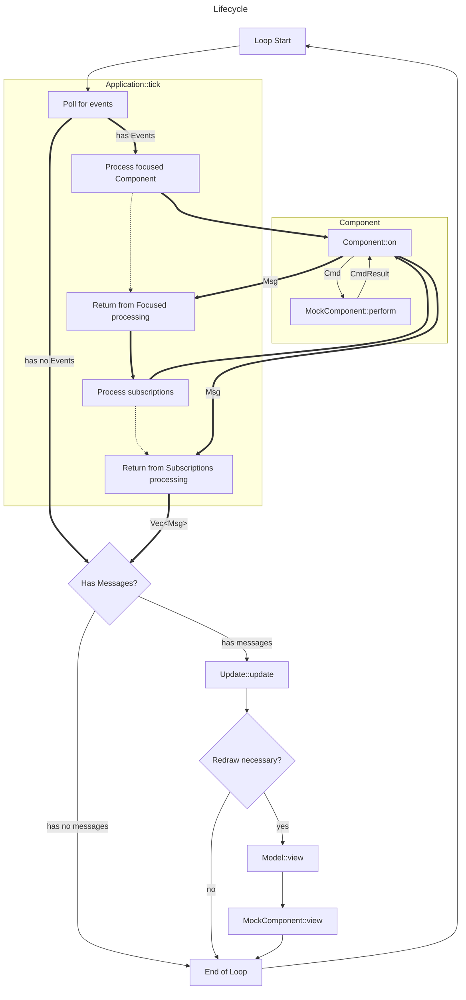

# Get Started 🏁

📍<u>**English**</u> | <a href="../zh-cn/get-started.md">简体中文</a>

- [Get Started 🏁](#get-started-)
  - [An introduction to realm](#an-introduction-to-realm)
  - [Key Concepts](#key-concepts)
  - [MockComponent Vs. Component](#mockcomponent-vs-component)
    - [The Mock Component](#the-mock-component)
    - [The Component](#the-component)
    - [Properties Vs. States](#properties-vs-states)
    - [Events Vs. Commands](#events-vs-commands)
  - [Application, Model and View](#application-model-and-view)
    - [The View](#the-view)
      - [Focus](#focus)
    - [Model](#model)
    - [The Application](#the-application)
  - [Lifecycle (or "tick")](#lifecycle-or-tick)
  - [Our first application](#our-first-application)
    - [Let's implement the Counter](#lets-implement-the-counter)
    - [Let's define the message type](#lets-define-the-message-type)
    - [Let's define the component identifiers](#lets-define-the-component-identifiers)
    - [Implementing the two counter components](#implementing-the-two-counter-components)
    - [Implementing the model](#implementing-the-model)
    - [Application setup and main loop](#application-setup-and-main-loop)
  - [What's next](#whats-next)

---

## An introduction to realm

What you will learn:

- The key concepts of tui-realm
- How to code a tui-realm application from scratch
- What makes tui-realm cool

`tui-realm` is a ratatui **framework** which provides an easy way to implement stateful application.
First of all, let's give a look to the main features of tui-realm and why you should opt for this framework when building
terminal user interfaces:

- ⌨️ **Event-driven**

    `tui-realm` uses the `Event -> Msg` approach, taken from Elm. **Events** are produced by entities called `Port`, which work as event listener (such as a stdin reader or an HTTP client), which produce Events. These are then forwarded to **Components**, which will produce a **Message**. The message then will cause a certain behaviour on your application model, based on its variant.

- ⚛️ Based on **React** and **Elm**

    `tui-realm` is based on select elements of [React](https://reactjs.org/) and [Elm](https://elm-lang.org/). These two are different in their approaches, but I decided to take the best from each of them to combine them in **Realm**. From React I took the **Component** concept. In realm each component represents a single graphic instance, which could potentially include some children; each component then has a **State** and some **Properties**.
    From Elm I basically took every other concept implemented in Realm. I really like Elm as a language, in particular the **TEA**(`The Elm Architecture`).
    Like as in Elm, in realm the lifecycle of the application is `-> Event -> Msg -> Update -> View ->`.

- 🍲 **Boilerplate** code

    `tui-realm` may look hard to work with at the beginning, but after a while you'll be start realizing how the code you're implementing is just boilerplate code you're copying from your previous components.

- 🚀 Quick-setup

    Thank to the `Application`, `EventListener`, Terminal backend and the stdlib, it is easy to get started.

- 🎯 Single **focus** and **states** management

    Instead of managing focus and states by yourself, in realm everything is automatically managed by the **View**, which is where all components are mounted. With realm you don't have to worry about the application states and focus anymore.

- 🙂 Easy to learn

    Thanks to the Guides, Examples and straight-forward types, it's really easy to learn tui-realm, even if you've never worked with a tui, React or Elm before.

- 🤖 Adaptable to any use case

    As you will learn through this guide, `tui-realm` exposes some advanced concepts to create your own event listener, to work with your own event and to implement complex components.

---

## Key Concepts

In the introduction you've probably read about some of them in **bold**, but let's see them in detail now. Key concepts are really important to understand, luckily they're easy to understand and there aren't many of them:

- **MockComponent**: A Mock component represents a re-usable UI component, which can have some **properties** for rendering or to handle commands. It can also have its own **states**, if necessary. In practice it is a trait which exposes some methods to render and to handle properties, states and events. We'll see it in detail in the next chapter.
- **Component**: A component is a wrapper around a **MockComponent** which represents a single component in your application. It directly takes events and generates messages for the application consumer. Underneath it relies on its Mock component for properties/states management and rendering.
- **State**: The state represents the current state for a component (e.g. the current text in a text input). The state depends on how the user (or other sources) interacts with the component (e.g. the user press 'a', and the char is pushed to the text input).
- **Attribute**: An attribute describes a single property in a component. The attribute shouldn't depend on the component state, but should only be configured by the user when the component is initialized. Usually a mock component exposes many attributes to be configured, and the component using the mock, sets them based on what the user requires.
- **Event**: an event is a **raw** entity describing that something happened, for example user input or other sources (we're going to talk about these last in the "advanced concepts").
- **Message** (or usually called `Msg`): A message is a Logic event that is generated by the Components in reaction to a `Event`, to be consumed by the `Model`.
    While the Event is *raw* (such as a keystroke), the message is application-oriented. The message is later consumed by the **Update routine**.

- **Command** (or usually called `Cmd`): Is an entity generated by the **Component** when it receives an **Event**. It is used by the component to operate on its **MockComponent**.
- **View**: The view is where all the components are stored. The view has basically three tasks:
  - **Managing components mounting/unmounting**: components are mounted into the view when they're created. The view prevents mounting duplicated components (on the same `Id`) and will warn you when you try to operate on unmounted component.
  - **Managing focus**: the view guarantees that only one component at a time is active. The active component is enabled with a dedicated attribute (we'll see that later) and all the events will be forwarded to it (and all *Subscribed* components). The view keeps track of all the previously focused components, so if the current active component loses focus, the previous active one is active if there's no other component to active.
  - **Providing an API to operate on components**: Once components are mounted into the view, they must be accessible to the outside, but in a safe way. That's possible thanks to the bridge methods the view exposes. Since each component must be uniquely identified to be accessed, you'll have to define some **ID**s for your components.
- **Model**: The model is a structure you'll define for your application to implement the **Update routine**.
- **Update routine**: The update routine is a function, which must be implemented by the **Model** and is part of the *Update trait*. This function is as simple as it is important. It only takes 2 parameters: itself mutably and the **Message** to process. Based on the *Message*, it invokes a certain behaviour on the Model or on the view. The routine can return a *Message* aswell, which will cause the routine to be called again by the application with the given *Message*. Later, when we'll see the example you'll see how this is just cool.
- **Subscription** (or usually called *Sub*): A subscription is a ruleset which tells the **application** to also forward specific events to other components even if they're not focused. We'll talk about subscription in advanced concepts.
- **Port**: A port is an event listener which will use a trait called `Poll` to fetch for incoming events. A port defines both the trait to call and an interval which must elapse between each call. The events are then forwarded to the subscribed components. The input listener is a port, but you may also implement for example an HTTP client, which fetches for some data. Ports are explained in advanced concepts.
- **Event Listener**: It is a thread which polls **Ports** to read for incoming events. The **Events** are then reported to the **Application**.
- **Application**: The application is a super wrapper around the **View**, the **Subscriptions** and the **Event Listener**. It exposes a bridge to the view, some shorthands to the *subscriptions*; but is main function, though, is called `tick()`. As we'll see later, `tick` is where all the framework magic happens.

---

## MockComponent Vs. Component

Even with the description above, you may ask yourself "What is the difference between those 2, why are they necessary?".
This is mainly due to how Events are designed to allow for custom `UserEvent`s and how rust works. If those 2 traits would be one, then libraries (like stdlib) would still need to implement a partial `on` update function, only relying on Event variants provided by `tui-realm` core. They would also likely need a generic on every component that practically would go unused to to being unable to rely on `UserEvent`s, adding extra clutter.
Separate traits also make for a good separation of concerns and allow modifying how things are passed to the underlying MockComponent.

Additionally, keep in mind that **Component** is always a **MockComponent**, but a **MockComponent** only *may* be a **Component**.

Let's see their definition in details:

### The Mock Component

The mock component is meant to be agnostic regarding events and *re-usable* in other places (even different projects).

For instance:

- ✅ A Label which shows a single line of text makes a good mock component.
- ✅ An Input component like `<input>` in HTML is a good mock component. Even if it can handle many input types, it still has one responsibility, is generic and is re-usable.
- ❌ An input which can handle both text, radio buttons and checks is a bad mock component. It is too generic.
- ❌ An input which takes the remote address for a server is a bad mock component. It is not generic.

These are only guidelines, but just to give you the idea of what a mock component is.

A mock component also handles **States** and **Props**, which are totally user-defined based on your needs. Sometimes you may even have component which don't handle any state (e.g. a label).

In practice a mock component is a trait, with these methods to be implmented:

```rust
pub trait MockComponent {
    fn view(&mut self, frame: &mut Frame, area: Rect);
    fn query(&self, attr: Attribute) -> Option<AttrValue>;
    fn attr(&mut self, attr: Attribute, value: AttrValue);
    fn state(&self) -> State;
    fn perform(&mut self, cmd: Cmd) -> CmdResult;
}
```

the trait requires you to implement:

- *view*: a method which renders the component in the provided area. You must use `ratatui` widgets to render your component based on its properties and states.
- *query*: returns the value for a certain attribute in the component properties.
- *attr*: assign a certain attribute to the component properties.
- *state*: get the current component state. If has no state will return `State::None`.
- *perform*: Performs the provided **command** on the component. This method is called by the **Component** as we'll see later. The command should change the component states. Once the action has been processed, it must return the `CmdResult` to the **Component**.

### The Component

So, apparently the mock component defines everything we need handle properties, states and rendering. So why are we not done yet and we need a component trait too?

1. MockComponent must be agnostic over **Event**s: mock components may be distribuited in libraries (e.g. `tui-realm-stdlib`) and because of that, they cannot consume `Event` or produce `Message`.
2. Because of point 1, we need an entity which consumed **Event**s and produces **Messages**. These two entities are totally or partially user-defined, which means, they are different for each realm application. This means the component must fit to the application.
3. **It's impossible to fit a component to everybody's needs**: I tried to in `tui-realm` 0.x, but it was just impossible. At a certain point I just started to add properties among other properties, but eventually I ended up re-implementing stdlib components from scratch just to have some different logics. Mock Components are good because they're generic, but not too much; they must behave as dummies to us. Components are exactly what we want for the application. For example, we have a Input, and want to change its colors based on what is written; one application may want to change color everytime when `a` is types, others may want to `the` is written. This may be possible with a lot of options, or validation in a given Input, but this logic is better suited to **Component** instead of *MockComponent**. Oh, and I almost forgot the worst thing about generalizing mocks: **keybindings**.

With that said, what actually is a component?

A component is an application specific unique implementation of a mock. Let's think for example of a form and let's say the first field is an input text which takes the username. If we think about it in HTML, it will be for sure a `<input type="text" />` right? With just that definition, the input is generic over what text is input, it may have some validation associated, but ultimately it has no meaning on submit. But we want it to be our username input and on Submit generate the appropriate **Message**. So the input text will be the `MockComponent` in tui-realm. But *that* "username" input field, will be *your* **username input text**. The `UsernameInput` *Component* will wrap a `Input` *MockComponent*, but based on incoming events it will operate differently on the mock and will produce different **Messages** if compared for instance to a `EmailInput`.

So, let me state the most important thing you must keep in mind from now on: **Components are unique ❗** to your application. You **should never blindly use the same Component more than once**.

Let's see what a component is in practice now:

```rust
pub trait Component<Msg, UserEvent>: MockComponent
where
    Msg: PartialEq,
    UserEvent: Eq + PartialEq + Clone,
{
    fn on(&mut self, ev: &Event<UserEvent>) -> Option<Msg>;
}
```

Quite simple eh? Yep, it was my intention to make them as light as possible, since you'll have to implement one for each component in your view. As you can also notice, a **Component** requires to also be a **MockComponent** so in practice we'll also have something like:

```rust
pub struct UsernameInput {
    component: Input, // Where input implements `MockComponent`
}

impl MockComponent for UsernameInput { /* Passthrough to "self.component" */ }
impl Component for UsernameInput { ... }
```

Due to requiring **MockComponent** to be implemented for each **Component** and it being quite common to pass-through the calls, `#[derive(MockComponent)]` can be used instead.

Another thing you may have noticed and that may frighten some of you are the two generic types that Component takes.
Let's see what these two types are:

- `Msg` (or also called **Message**): defines the type of the **Message** your application will handle in the **Update routine**. Indeed, in `tui-realm` the messages are not defined in the library, but are defined by the user. We'll see this in detail later in [Our first application](#our-first-application). The only requirements for Message, is that it must implement `PartialEq`, since you must be able to match it in the **Update routine**.
- `UserEvent`: The user event defines a custom events your application can handle. As we said before `tui-realm` usually will send events concerning user input or terminal events, plus a special event called `Tick` (but we'll talk about it later). In addition to these common events though, custom **Port**s may return events from other sources that dont align with the common events. Since `tui-realm` needs to know what these events are, you need to provide the type your ports will produce. (more on that in the [advanced guide](./advanced.md))

    If we give a look to the `Event` enum, everything will become clear:

    ```rust
    pub enum Event<UserEvent>
    where
        UserEvent: Eq + PartialEq + Clone,
    {
        /// A keyboard event
        Keyboard(KeyEvent),
        /// This event is raised after the terminal window is resized
        WindowResize(u16, u16),
        /// A ui tick event (should be configurable)
        Tick,
        /// Unhandled event; Empty event
        None,
        /// User event; won't be used by standard library or by default input event listener;
        /// but can be used in user defined ports
        User(UserEvent),
    }
    ```

    As you can see there is a special variant for `Event` called `User` which takes a special type `UserEvent`, which can be indeed used to use user-defined events.

    > ❗If you don't have any `UserEvent` in your application, you can declare events passing `Event<NoUserEvent>`, which `tui-realm` provides.

### Properties Vs. States

All components are described by properties and quite often by states as well. But what is the difference between them?

Basically **Properties** describe how the component is rendered and how it should behave.

For example, properties are **styles**, **color** or some properties such as "should this list scroll?".
Properties are always present in a component.

States, on the other hand, are optional and *usually* are used only by components which the user can interact with.
The state won't describe styles or how a component behaves, but the current state of a component. The state, also will usually change after the user performs a certain **Command**.

Let's see for example how to distinguish properties from states on a component and let's say this component is a *Checkbox*:

- The checkbox foreground and background are **Properties** (doesn't change on interaction)
- The checkbox options are **Properties**
- The current selected options are **States**. (they change on user interaction)
- The current highlighted item is a **State**.

### Events Vs. Commands

We've almost seen all of the aspects behind components, but we still need to talk about an important concept, which is the difference between **Events** and **Commands**.

If we give a look to the **Component** trait, we'll see that the method `on()` has the following signature:

```rust
fn on(&mut self, ev: Event<UserEvent>) -> Option<Msg>;
```

and we know that the `Component::on()` will call the `perform()` method of its **MockComponent**, in order to update its states. The perform method has this signature instead:

```rust
fn perform(&mut self, cmd: Cmd) -> CmdResult;
```

As you can see, the **Component** consumes an `Event` and produces a `Msg`, while the mock, which is called by the component, consumes a `Cmd` and produces a `CmdResult`.

If we give a look to the two type declarations, we'll see there is a difference in terms of scope, let's give a look:

```rust
pub enum Event<UserEvent>
where
    UserEvent: Eq + PartialEq + Clone,
{
    /// A keyboard event
    Keyboard(KeyEvent),
    /// This event is raised after the terminal window is resized
    WindowResize(u16, u16),
    /// A ui tick event (should be configurable)
    Tick,
    /// Unhandled event; Empty event
    None,
    /// User event; won't be used by standard library or by default input event listener;
    /// but can be used in user defined ports
    User(UserEvent),
}

pub enum Cmd {
    /// Describes a "user" typed a character
    Type(char),
    /// Describes a "cursor" movement, or a movement of another kind
    Move(Direction),
    /// An expansion of `Move` which defines the scroll. The step should be defined in props, if any.
    Scroll(Direction),
    /// User submit field
    Submit,
    /// User "deleted" something
    Delete,
    /// User toggled something
    Toggle,
    /// User changed something
    Change,
    /// A user defined amount of time has passed and the component should be updated
    Tick,
    /// A user defined command type. You won't find these kind of Command in the stdlib, but you can use them in your own components.
    Custom(&'static str),
    /// `None` won't do anything
    None,
}
```

For some aspects, they both look similiar, but something immediately appears clear:

- Event is strictly bounded to the "hardware", it takes key event, terminal events or event from other sources.
- Cmd is completely independent from the hardware and terminal, and it's all about UI logic. We still have `KeyEvent`, but we've also got `Type`, `Move`, `Submit`, custom events (but not with generics) and etc.

The reason behind this, is quite simple: **MockComponent** must be application-independent. You can create your components in a library and distribute it on Github, crate.io, or wherever you want, and it still must be able to work. If they took events as parameters, this couldn't be possible, since event takes in a generic, which is application-dependent.

And there's also another reason: let's imagine we have a component with a list you can scroll on and view different elements. You can scroll up/down with keys. If I wanted to create a library of components and we had events only, it wouldn't be possible to use different keybindings. Think about, with mock components I expect that in `perform()`, when we receive a `Cmd::Scroll(Direction::Up)` the list scrolls up, then I can implement my `Component` which will send a `Cmd::Scroll(Direction::Up)` when `W` is typed and another component which will send the same event when `<UP>` is pressed. Thanks to this mechanism, `tui-realm` mock components are also totally independent from key-bindings, which in tui-realm 0.x, was just a hassle.

So whenever you implement a **MockComponent**, you must keep in mind that you should make it application-independent, so you must define its **Command API** and define what kind of **CmdResult** it'll produce. Then, your components must generate on whatever kind of events the `Cmd` accepted by the API, and handle the `CmdResult`, and finally, based on the value of the `CmdResult` return a certain kind of **Message** based on your application.

We're finally starting to define the lifecycle of `tui-realm`. This segment of the cycle, is described as `Event -> (Cmd -> CmdResult) -> Msg`.

---

## Application, Model and View

Now that we have defined what Components are, we can finally start talking about how all these components can be put together to create an **Application**.

In order to put everything together, we'll use three different entities, we've already briefly seen before, which are:

- The **Application**
- The **Model**
- The **View**

First, starting from components, the first thing we need to talk about, is the **View**.

### The View

The view is basically a box for all the components. All the components which are part of the same "view" (in terms of UI) must be *mounted* in the same **View**.
Each component in the view, **Must** be identified uniquely by an **Identifier**(or also usually called *Id*), where the identifier is a type you must define, usually it is a Enum, but it can be other things like (static) strings too.

Once a component is mounted, it won't be directly accessable anymore. The view will store it as a generic `Component` and will expose a bridge to operate on all the components in the view, querying them with their **Identifier**.

The component will be part of the view, until you unmount the component. Once the component is unmounted, it won't be usable anymore and it'll be dropped.

The view is not just a list of components though, it also plays a fundamental role in the UI development. For example, the **View** also handles focus and event forwarding. Let's talk about it in the next chapter

#### Focus

Whenever you interact with components in a UI, there must always be a way to determine which component will handle the interaction. If I press a key, the View must be able to correctly forward those **Event**s to the focused **Component**.
Focus is just a state the View tracks. At any time, the view must know which component is currently *active* and what to do, in case that component is unmounted.

In `tui-realm`, I decided to define the following rules, when working with focus:

1. Only one component at a time can have focus
2. All events will be forwarded to the component that currently owns focus.
3. A Component can only gain focused via the `active()` method.
4. If a component gets focus, then its `Attribute::Focus` property becomes `AttrValue::Flag(true)`
5. If a component loses focus, then its `Attribute::Focus` property becomes `AttrValue::Flag(false)`
6. Each time a component gets focus, the previously active component loses focus and is appended into a `Stack` (called *focus stack*) holding all the previous components owning focus.
7. If a component owning focus, is **unmounted**, the most recent component in the **Focus stack** that is still mounted becomes active
8. If a component owning focus, gets disabled via the `blur()` method, the most recent component in the **Focus stack** becomes active, but the *blurred* component, is not pushed into the **Focus stack**. (`blur` can also be read as `focus_previous_component`)

The following table shows how focus works:

| Action    | Focus | Focus Stack | Components |
|-----------|-------|-------------|------------|
| Active A  | A     |             | A, B, C    |
| Active B  | B     | A           | A, B, C    |
| Active C  | C     | B, A        | A, B, C    |
| Blur      | B     | A           | A, B, C    |
| Active C  | C     | B, A        | A, B, C    |
| Active A  | A     | C, B        | A, B, C    |
| Umount A  | C     | B           | B, C       |
| Mount D   | C     | B           | B, C, D    |
| Umount B  | C     |             | C, D       |
| Blur(err) | C     |             | C, D       |

### Model

The model is a struct which is fully defined by the user implementing a `tui-realm` application. Its only 2 required methods are the **Update routine** and **Draw routine**.

We'll soon see this in detail, when we'll talk about the *application*, but for now, all we need to know is what the **Update routine** does, which is implemented via `update` function:

```rust
/// Update the current state handling a message from the view.
/// This function may return a Message,
/// so this function has to be intended to be call recursively if necessary
fn update(&mut self, msg: Option<Msg>) -> Option<Msg>;
```

The update method, receives a mutable reference to the model(self) and potentially the incoming message from the component, which processed a certain type of event.
Inside the update, we'll match the msg, to perform certain operation on the model or on the view and we'll return `None` or another message, if necessary. As we'll see, if we return `Some(Msg)`, we can re-call the routine passing as argument the last generated message.

### The Application

Finally we're ready to talk about the core struct of tui-realm, the **Application**. Let's see which tasks it takes care of:

- It contains the **View** and provides a way to operate on it, as usual using the component *identifiers*.
- It handles **Subscriptions**. As we've already seen before, *subscriptions* are special rules which tells the application to forward events to other components if some clauses are satisfied, even if that component is not focused.
- It reads incoming events from **Ports**.

As we can see in its definition, the application is a container for all these entities:

```rust
pub struct Application<ComponentId, Msg, UserEvent>
where
    ComponentId: Eq + PartialEq + Clone + Hash,
    Msg: PartialEq,
    UserEvent: Eq + PartialEq + Clone + Send + 'static,
{
    listener: EventListener<UserEvent>,
    subs: Vec<Subscription<ComponentId, UserEvent>>,
    view: View<ComponentId, Msg, UserEvent>,
}
```

So the application will be the sandbox for all the entities a `tui-realm` app needs (and that's why is called **Application**).

But the coolest thing here, is that all of the application can be run using a single method! This method is called `tick()` and as we'll see in the next chapter it performs all what is necessary to complete a `Event -> Component(s) -> Msg` cycle:

```rust
pub fn tick(&mut self, strategy: PollStrategy) -> ApplicationResult<Vec<Msg>> {
    // Poll event listener
    let events = self.poll(strategy)?;
    // Forward to active element
    let mut messages: Vec<Msg> = events
        .iter()
        .map(|x| self.forward_to_active_component(x.clone()))
        .flatten()
        .collect();
    // Forward to subscriptions and extend vector
    messages.extend(self.forward_to_subscriptions(events));
    Ok(messages)
}
```

As we can quickly see, the tick method has the following workflow:

1. The event listener is fetched according to the provided `PollStrategy`

    > ❗The poll strategy tells how to poll the event listener. For example you can only fetch one event per cycle, or multiple; various Strategies are available. For a fully event driven application `BlockingUpTo` is recommended.

2. All the incoming events are immediately forwarded to the current *active* component in the *view*, which may return some *messages*
3. All the incoming events are sent to all the components subscribed to that event, which satisfied the clauses described in the subscription. They, as usual, will may return some *messages*
4. The messages are returned

Along to the `tick()` routine, the application provides many other functionalities, but we'll see later in the example and don't forget to checkout the documentation.

---

## Lifecycle (or "tick")

We're finally ready to put it all together to see the entire lifecycle of the application.
Once the application is set up, the cycle of our application will be the following one:



<!--Convenietly edit on https://mermaid.live-->

In the diagramm above we can see the flow of what gets executed when. There are 3 types of lines: Thin, Thick and Dottet. The Dottet line is to help understand flow, the Thick line is to indicate automatic calling by the **Application**, finally the Thin line is what needs to be implemented by the users.

In the image, we can see there are all the entities we've talked about earlier, which are connected through two kind of arrows, the *black* arrows defines the flow you have to implement, while the *red* arrows, follows what is already implemented and implicitly called by the application.

So the `tui-realm` lifecycle consists of:

1. the `tick()` routine is called on **Application**
   1. Ports are polled for incoming events
   2. Events are forwarded to the active component in the view
   3. Subscriptions are queried to know whether the event should be forwarded to other components, then forward those events
   4. incoming messages are returned to the caller
2. the **`update()` routine** is called on **Model** for each message from `tick` (and each message `update` may return)
3. The model gets updated thanks to the `update()` method
4. The `view()` function is called to render the UI

This simple 4-step cycle is called a **Tick**, because it defines the interval between each UI refresh in fact.
Now that we know how a `tui-realm` application works, let's see how to implement one.

---

## Our first application

We're finally ready to set up a realm `tui-realm` application. In this example we're going to start with something very simple.
The application we're going to implement is really simple, we've got two **counters**, one will track when an alphabetic character is pressed by the user and the other when a digit is pressed by the user. Both of them will track events only when active. The active component will switch between the two counters pressing `<TAB>`, while pressing `<ESC>` the application will terminate.

> This example will result in something similar to [the demo example](/examples/demo/demo.rs).

### Let's implement the Counter

So we've said we have two Counters, one tracking alphabetic characters and one digits, so we've found a potential **MockComponent**: the **Counter**. The counter will just have a state keeping track of "times" as a number and will increment each time a certain command will be sent.
With that said, let's start to implement the counter:

```rust
struct Counter {
    props: Props,
    states: OwnStates,
}
```

Like many other components, we need `props` to store properties like color and text style.
We also have `states` due to us needing to keep track of the `times` to display.
Because we have states, we also need to declare them:

```rust
#[derive(Default)]
struct OwnStates {
    counter: isize,
}

impl OwnStates {
    fn incr(&mut self) {
        self.counter += 1;
    }
}
```

Then, we'll implement easy-to-use Builder methods for our mock component:

```rust
impl Counter {
    pub fn label<S>(mut self, label: S) -> Self
    where
        S: AsRef<str>,
    {
        self.attr(
            Attribute::Title,
            AttrValue::Title((label.as_ref().to_string(), Alignment::Center)),
        );
        self
    }

    pub fn value(mut self, n: isize) -> Self {
        self.attr(Attribute::Value, AttrValue::Number(n));
        self
    }

    pub fn foreground(mut self, c: Color) -> Self {
        self.attr(Attribute::Foreground, AttrValue::Color(c));
        self
    }

    pub fn background(mut self, c: Color) -> Self {
        self.attr(Attribute::Background, AttrValue::Color(c));
        self
    }
}
```

Finally we can implement `MockComponent` for `Counter`

```rust
impl MockComponent for Counter {
    fn view(&mut self, frame: &mut Frame, area: Rect) {
        // Check if the component is meant to be displayed or hidden
        if !self.props.get_or(Attribute::Display, AttrValue::Flag(true)).unwrap_flag() {
            return;
        }

        // Get the text we want to display
        let count_str = self.states.counter.to_string();

        // Get other properties to apply
        let foreground = self
            .props
            .get_or(Attribute::Foreground, AttrValue::Color(Color::Reset))
            .unwrap_color();
        let background = self
            .props
            .get_or(Attribute::Background, AttrValue::Color(Color::Reset))
            .unwrap_color();
        let style = Style::default()
            .fg(foreground)
            .bg(background);

        let title = self
            .props
            .get_or(
                Attribute::Title,
                AttrValue::Title(Title::default()),
            )
            .unwrap_title();
        let borders = self
            .props
            .get_or(Attribute::Borders, AttrValue::Borders(Borders::default()))
            .unwrap_borders();
        // we also want to draw the block border differently depending if the component is focused or not
        let focus = self
            .props
            .get_or(Attribute::Focus, AttrValue::Flag(false))
            .unwrap_flag();

        let block = Block::default()
            .title_top(title.content)
            .borders(borders.sides)
            .border_style(if focus { borders.style() } else { Style::default().fg(Color::DarkGrey) });

        frame.render_widget(
            Paragraph::new(count_str)
                .block(block)
                .style(style)
                .alignment(alignment),
            area,
        );
    }

    fn query(&self, attr: Attribute) -> Option<AttrValue> {
        self.props.get(attr)
    }

    fn attr(&mut self, attr: Attribute, value: AttrValue) {
        self.props.set(attr, value);
    }

    fn state(&self) -> State {
        State::One(StateValue::Isize(self.states.counter))
    }

    fn perform(&mut self, cmd: Cmd) -> CmdResult {
        match cmd {
            Cmd::Submit => {
                self.states.incr();
                CmdResult::Changed(self.state())
            }
            _ => CmdResult::None,
        }
    }
}
```

This is one big code dump, so lets break it down:

- in `view` we fetch all properties that can be set and apply them to be drawn
- in `query` and `attr` just pass them right through to `Props` to get / set the properties
- in `state` return the current counter `times` value
- in `perform`, on Command `Submit` we increment the counter and return a `Changed` value and ignore all other commands

With that our **MockComponent** is ready, we could now implement our two **Components**, but we also need some other types like **Messages**, so lets go and do those first.

### Let's define the message type

Before implementing the two `Component` we first need to define the messages our application will handle.
So for our Application, we define an enum `Msg`:

```rust
#[derive(Debug, PartialEq)]
pub enum Msg {
    /// Stop the application
    AppClose,
    /// Digit counter has changed to the given value
    DigitCounterChanged(isize),
    /// Blurring has been requested while on "Digit" counter
    DigitCounterBlur,
    /// Letter counter has changed to the given value
    LetterCounterChanged(isize),
    /// Blurring has been requested while on "Letter" counter
    LetterCounterBlur,
}
```

### Let's define the component identifiers

We also need to define the **Identifiers** for our components, they will be used by the view to query mounted components.
So for our application, as we did for `Msg`, let's define `Id` with a Enum:

```rust
#[derive(Debug, Eq, PartialEq, Clone, Hash)]
pub enum Id {
    DigitCounter,
    LetterCounter,
}
```

### Implementing the two counter components

We'll have two types of counters, so we'll call them `LetterCounter` and `DigitCounter`. Let's implement them!

First we define the `LetterCounter` with the mock component within. Since we don't need any particular behaviour for the `MockComponent` trait, we can simply derive `MockComponent`, which will automatically pass through all `MockComponent` calls to the underlying `MockComponent`. If you want to read more read see [tuirealm_derive](https://github.com/veeso/tuirealm_derive).

```rust
#[derive(MockComponent)]
pub struct LetterCounter {
    component: Counter,
}
```

Then we implement the constructor for the letter counter, it accepts the initial value and construct a `Counter` using the mock component constructor:

```rust
impl LetterCounter {
    pub fn new(initial_value: isize) -> Self {
        Self {
            component: Counter::default()
                .background(Color::Reset)
                .borders(
                    Borders::default().color(Color::LightGreen),
                )
                .foreground(Color::LightGreen)
                .label("Letter counter")
                .value(initial_value),
        }
    }
}
```

Finally we implement the `Component` trait for the `LetterCounter`. Here we first convert the incoming `Event` to a `Cmd`, then we call `perform()` on the mock to get the `CmdResult` in order to produce a `Msg`.
When the event is `Esc` or `Tab` we directly return the `Msg` to close app or to change focus.

```rust
impl Component<Msg, NoUserEvent> for LetterCounter {
    fn on(&mut self, ev: &Event<NoUserEvent>) -> Option<Msg> {
        // Get command
        let cmd = match ev {
            Event::Keyboard(KeyEvent {
                code: Key::Char(ch),
                modifiers: KeyModifiers::NONE,
            }) if ch.is_alphabetic() => Cmd::Submit,
            Event::Keyboard(KeyEvent {
                code: Key::Tab,
                modifiers: KeyModifiers::NONE,
            }) => return Some(Msg::LetterCounterBlur), // Return focus lost
            Event::Keyboard(KeyEvent {
                code: Key::Esc,
                modifiers: KeyModifiers::NONE,
            }) => return Some(Msg::AppClose),
            _ => Cmd::None,
        };
        // perform
        match self.perform(cmd) {
            CmdResult::Changed(State::One(StateValue::Isize(c))) => {
                Some(Msg::LetterCounterChanged(c))
            }
            _ => None,
        }
    }
}
```

We'll do the same for the `DigitCounter`, but on `on()` instead of `is_alphabetic` we use `is_ascii_digit`.

### Implementing the model

Now that we have the components, we're almost done. We can finally implement the `Model`. I made a very simple model for this example:

```rust
pub struct Model {
    /// Application
    pub app: Application<Id, Msg, NoUserEvent>,
    /// Indicates that the application must quit
    pub quit: bool,
    /// Tells whether to redraw interface
    pub redraw: bool,
    /// Used to draw to terminal
    pub terminal: CrosstermTerminalAdapter,
}
```

> ❗ Insted of `CrosstermTerminalAdapter` other backends can be used, or it could even be generic over `TerminalAdapter`.

Now, we'll implement the `view()` method, which will render the GUI after updating the model:

```rust
impl Model {
    pub fn view(&mut self) {
        self
            .terminal
            .draw(|f| {
                let [letter, digit] = Layout::default()
                    .direction(Direction::Vertical)
                    .margin(1)
                    .constraints(
                        [
                            Constraint::Length(3), // Letter Counter
                            Constraint::Length(3), // Digit Counter
                        ]
                    )
                    .areas(f.size());
                self.app.view(&Id::LetterCounter, f, letter);
                self.app.view(&Id::DigitCounter, f, digit);
            }).expect("App to draw without error");
    }
}
```

> ❗ If you're not familiar with the `draw()` function, please read the [ratatui](https://ratatui.rs/) documentation.

Finally we can implement the `Update` trait:

```rust
impl Update<Msg> for Model {
    fn update(&mut self, msg: Option<Msg>) -> Option<Msg> {
        let msg = msg?;

        // Set redraw
        self.redraw = true;
        // Match message
        match msg {
            Msg::AppClose => {
                self.quit = true; // Terminate
                None
            }
            Msg::DigitCounterBlur => {
                // Give focus to letter counter
                self.app.active(&Id::LetterCounter).expect("LetterCounter to be mounted");
                None
            }
            Msg::DigitCounterChanged(v) => {
                // Update label
                self
                    .app
                    .attr(
                        &Id::Label,
                        Attribute::Text,
                        AttrValue::String(format!("DigitCounter has now value: {}", v))
                    )
                    .expect("Label to be mounted");
                None
            }
            Msg::LetterCounterBlur => {
                // Give focus to digit counter
                self.app.active(&Id::DigitCounter).expect("DigitCounter to be mounted");
                None
            }
            Msg::LetterCounterChanged(v) => {
                // Update label
                self
                    .app
                    .attr(
                        &Id::Label,
                        Attribute::Text,
                        AttrValue::String(format!("LetterCounter has now value: {}", v))
                    )
                    .expect("Label to be mounted");
                None
            }
        }
    }
}
```

If you are familiar with how Elm works, here is the biggest difference: the `update` in `tui-realm` modifies in-place, instead of returning a new Model / Clone.

You may notice that the **Update routine** is within a trait, but the `view` method is not required to be a trait. Strictly speaking the `update` method also does not need to be a trait. Currently this allows passing-in extra data to `view` or calling it whatever you want.
This might change in the future.

### Application setup and main loop

We're almost done, lets just quickly create a helper method to create the **Application**. This is commonly associated to be in `Model`:

```rust
fn init_app() -> Application<Id, Msg, NoUserEvent> {
    // Setup application
    // NOTE: NoUserEvent is a shorthand to tell tui-realm we're not going to use any custom user event
    // NOTE: the event listener is configured to use the default crossterm input listener
    let mut app: Application<Id, Msg, NoUserEvent> = Application::init(
        EventListenerCfg::default()
            .crossterm_input_listener(Duration::from_millis(20)),
    );
}
```

The app requires the configuration for the `EventListener` which will poll `Ports`. We're telling the event listener to use the crossterm input listener for our backend.

> ❗ Here we could also define other Ports or setup the `Tick` producer with `tick_interval()`

Then we can mount the two components into the view:

```rust
app.mount(
    Id::LetterCounter,
    Box::new(LetterCounter::new(0)),
    Vec::default()
)?;
app.mount(
    Id::DigitCounter,
    Box::new(DigitCounter::new(5)),
    Vec::default()
)?;
```

> ❗ The two empty vectors are the subscriptions related to the component. (In this case none)

Then we initilize focus:

```rust
app.active(&Id::LetterCounter)?;
```

This can all be put together in a `Model` constructor:

```rust
impl Model {
    // this could also be a default impl
    pub fn new() -> Self {
        Self {
            app: Self::init_app().expect("Failed to mount components"),
            quit: false,
            redraw: true,
            terminal: Self::init_adapter().expect("Cannot initialize terminal"),
        }
    }

    fn init_app() -> Result<Application<Id, Msg, NoUserEvent>, Box<dyn Error>> { 
        let mut app: Application<Id, Msg, NoUserEvent> = Application::init(
            EventListenerCfg::default()
                .crossterm_input_listener(Duration::from_millis(20)),
        );

        app.mount(
            Id::LetterCounter,
            Box::new(LetterCounter::new(0)),
            Vec::default()
        )?;
        app.mount(
            Id::DigitCounter,
            Box::new(DigitCounter::new(5)),
            Vec::default()
        )?;

        app.active(&Id::LetterCounter)?;

        Ok(app)
    }

    /// Create the Backend and enter all modes we require
    fn init_adapter() -> TerminalResult<CrosstermTerminalAdapter> {
        let mut adapter = CrosstermTerminalAdapter::new()?;
        adapter.enable_raw_mode()?;
        adapter.enter_alternate_screen()?;

        Ok(adapter)
    }
}
```

Finally implement the **main loop**:

```rust
// Initial draw, otherwise we would have to wait for at least one event before *anything* is drawn (the output would remain blank)
model.view();

while !model.quit {
    // Tick
    match model.app.tick(PollStrategy::BlockingUpTo(1)) {
        Err(err) => {
            // Handle error...
        }
        Ok(messages) if !messages.is_empty() => {
            for msg in messages {
                // process messages returned by the Model immediately before other messages
                let mut msg = Some(msg);
                while msg.is_some() {
                    msg = model.update(msg);
                }
            }
        }
    }
    // Redraw
    if model.redraw {
        model.view(&mut app);
        model.redraw = false;
    }
}
```

On each cycle we call `tick()` on our application, with strategy `BlockingUpTo` with a max collection of events of `1`. If there is a message, we ask the Model to process the messages. After processing, we redraw, only if the Model has decided it needs to be re-drawn.

Once `quit` becomes true, the application terminates.
All backends provided by `tui-realm` itself, will automatically clean-up terminal modes on `Drop`.

---

## What's next

Now you know the fundamentals of `tui-realm`. There are still more advanced concepts to explore. Reading further is recommended for:

- [Advanced concepts](advanced.md)
- [Migrating from 3.x to 4.0](migrating-4.0.md)
- [ratatui: The Elm Architecture (TEA)](https://ratatui.rs/concepts/application-patterns/the-elm-architecture/)
