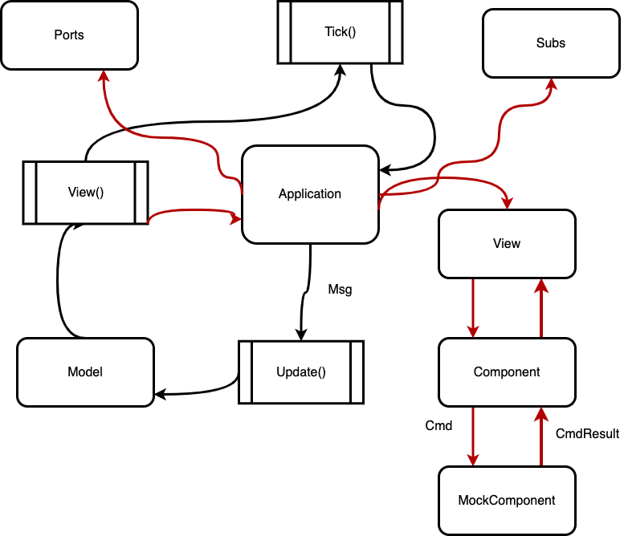

# Tui-realm application lifecycle

- [Tui-realm application lifecycle](#tui-realm-application-lifecycle)
  - [Introduction](#introduction)
    - [Components](#components)
    - [The View](#the-view)
      - [The focus](#the-focus)
    - [Messages](#messages)
    - [Putting it all together](#putting-it-all-together)
  - [What's next](#whats-next)

---

## Introduction

This document describes the lifecycle of a tui-realm application by the gui point of view.
To do so, we need first to introduce the main parts of a tui-realm application though.

### Components

A component is a logical layer which wraps the tui Widget. While the Widget is just the graphical element, the **Component** adds logic and properties to it.
A component is logically independent from the widget, which is created only when required, through the `render()` method as we'll soon see.

Basically then, a component is made up of 3 things:

- **Properties**: which describe how the component will work and how it'll be displayed
- **States**: which describe the current state of the component. The component state will change how it'll be rendered and how it'll respond to events. While properties are always required for a component, states are not.
- **Behaviours**: behaviours are functions each component must implement. This is accomplished via the `Component` trait in Rust. But what are these behaviours?
  - **render**: renders a widget in the area passed as argument
  - **update**: update the component properties. This will generate a Message, but we'll see them later.
  - **get_props**: returns a copy of the component properties. These properties can then be used to call update on the same component for example.
  - **on**: makes the component to handle an input event. The component will then return a Message.
  - **get_state**: Returns the current component state. With state in this case, we don't mean the entire state struct but just a meanful value for the user. Ideally each component should have a maximum of one meaningful state for the user. A component might also return Nothing.
  - **blur**: remove the focus from the component. When we'll talk about [View](#the-view), this will become more clear.
  - **active**: give the focus to the component. When we'll talk about [View](#the-view), this will become more clear.

### The View

Okay, so we now know about components, and yes, you might already be able to build an application without any problems. But how can we deal with a gui made up of dozens of them with confidence? That sounds complicated. Luckily the View comes in help for us.
What is a view? **A view is collection of components, each one is identified by a string name**. The view isn't just an hash map though, but it also does other two things:

- creates a bridge between the developer and the components
- handles the **focus**.

#### The focus

Yeah, exactly, the focus. The focus is something very important in GUIs and never so simple to handle. In a GUI we might assume a component may or not have focus. In realm focus is handled in a way I found really lovely:

- the focus might be held by a component
- in a stack, all the active components are kept in case the current component is blurred.

>> What does it mean? Okay, let's imagine we have 2 components: "A" and "B" and we give focus to "A", so now "A" is active. Up to now all clear I hope. Then the user presses DOWN, which for our application means the focus needs to be given to "B", so "B" becomes active (we can have focus only on one component). Let's say then our user presses DELETE and this causes the view to umount "B". Who has focus now? You might say none of them. I don't think so. It's true "A" hasn't the focus before, but it is also true that we never disabled "A". Thanks to the focus stack indeed, "A" will be re-enabled. This approach is in my opinion just perfect and very handy. It gives you the possibility not to care about re-give focus everytime to the previous component and at the same time you haven't to follow this approach at all. Indeed you could just disable "A" before enabling "B" and you would be perfectly fine.

---

What were we talking about? Uh yeah view, sorry for the interruption, but focus was just too important to skip it. So, I was saying the view is a container for components and the view tracks the focus for us, but that's not all.
First of all we need to say the view is not a static element, indeed once the view is initialized is empty and to add components, we'll need to *mount* them, through the namesake method `mount(id, component)`. Once the component is mounted it will be available to receive events, updates and queries (getters). And what if we don't need the component anymore? Well, we can just *umount* it and puff, the component will be gone, forever!

So, to summarize, these are the methods exposed by the **View**:

- **mount**: mount a new component in the view; the component has an ID associated, which must be unique, and will be used for the entire lifecycle of the component associated only to that component
- **umount**: this method will umount the component with the name associated to the function argument. Once the component is umounted it'll be gone forever. If the umounted component was the focus holder, the focus will be passed to the first component in the focus stack, if any; so yeah, you can always umount with confidence 💪🏻
- **render**: render the component associated to the provided id
- **get_props**: get properties for the component associated to the provided id
- **update**: update the component associated to the provided id. Will return a tuple made up of the id and the Msg.
- **get_state**: get state for the associated component
- **on**: calls `on()` on the current **active** component. **BE CAREFUL, you CANNOT CHOOSE which component WILL HANDLE THE EVENT**, this will **ALWAYS** be handled by the **ACTIVE** component.
- **blur**: blur current active component. If there is at least one element in the focus stack, the component on the top will be popped and will become the new focus holder. **WARNING**: when you **blur** a component, this **won't be pushed on the top of the focus stack**; that happens only if the component was **active and another one becomes active**. Don't get confuse, this is really important to understand 😉
- **active**: puts the current focus holder on the top of the focus stack, while the provided component becomes the new focus holder. If the new active component was already in the focus stack, it'll be removed from it.

### Messages

Okay, I know this is getting complicated afterall, but yet a little effort and we're done here.
When we've talked about the View and the components, you'll often encountered a type called **Message**, which is actually called `Msg` in realm.
But what is a message? A message is an enum, which holds events and data and is generated by components after the execution of an event.

Components have two behaviours which generate a Message:

- `on()`
- `update()`

As you've probably imagined, this methods likely change the component state, which must then be reported to the user somehow and that's what messages are for. Messages are just a way the component has to communicate with the end-user.

Okay, but in practice you say?
Well, let's see the definition of the `Msg` type:

```rust
pub enum Msg {
    OnSubmit(Payload),
    OnChange(Payload),
    OnKey(KeyEvent),
    None,
}
```

At the moment these are the messages a component can generate (I know there are only four, but they are enough, trust me).

- **OnSubmit**: likely generated after the user has submitted data (e.g. the user pressed Enter in an input text)
- **OnChange**: the state of a component has changed (e.g. the user changed the choice in a radio group)
- **OnKey**: a generic key has been pressed. Usually this event should be returned when we want to inform the application a key the component won't handle has been pressed, but maybe the application has a better way to handle this. In simpler words, this should be used to handle globals keys (e.g. the user pressed TAB on a radio group; this is used by the application to change input field)
- **None**: there's nothing to report. We use this to say to the gui engine it shouldn't care what the user did or that we've already handled the event completely and we don't want the gui to handle it.

I hope it has become more clear now, but I know there's still a data type you cannot understand and that's `Payload`.

The Payload is an enum and it's used to pass different kind of data across the application via a Msg, this is its definition:

```rust
pub enum Payload {
    Boolean(bool),
    Signed(isize),
    Text(String),
    Unsigned(usize),
    VecOfText(Vec<String>),
    VecOfUsize(Vec<usize>),
    None,
}
```

So it used to carry a payload with a message; sometimes you don't need to report a payload, but just the event itself, so I made `Payload::None` available 😉.

### Putting it all together

So now you know the basic elements of a tui-realm application. You should now be able to understand most of what was written in the [get-started guide](get-started.md).
Remember that to interface your application with this environment, you should always use the `view()` and the `update()` methods with a `Model` defined to satisfy your needs.
Now we can finally see the lifecycle of a realm application 🦄

---



---

## What's next

So finally you know how all the parts of a realm application. For your application you might be interested then in [which components are already available](std-components.md) and how to [implement your own](new-components.md).
